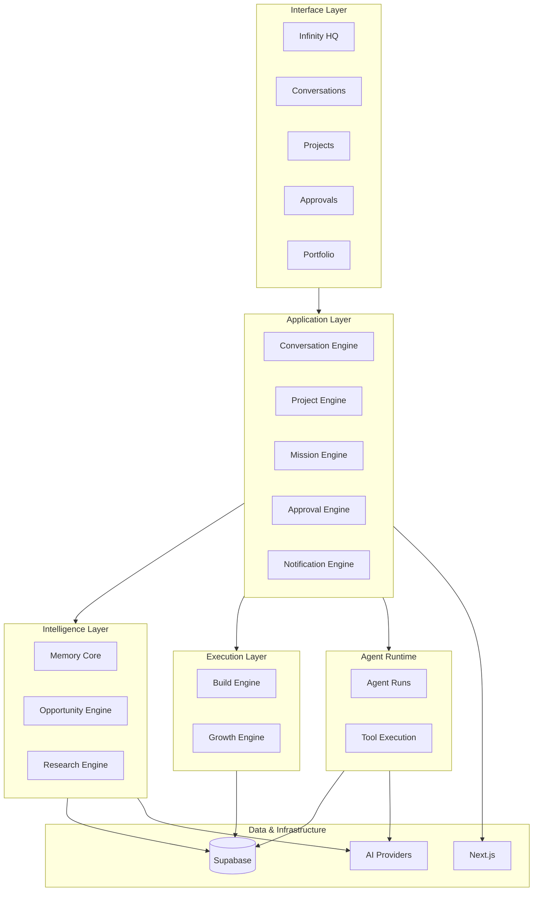

# Infinity Architecture Bible

> **Terminology update (v1.0):** Product and orchestration terminology is defined in [`infinity-architecture.md`](./infinity-architecture.md). This document remains the detailed Alpha schema and historical specification. Database table names such as `projects`, `companies`, and `opportunity_*` are intentionally unchanged.

## 1. Document Purpose

This file is the **authoritative technical and product architecture** for Infinity. It defines what Infinity is, how it is structured, what each part owns, and how future work must be implemented.

All implementation—by engineers or AI coding agents—must follow this document unless an approved **Architecture Decision Record (ADR)** in `docs/decisions/` explicitly changes it.

| Field | Value |
| --- | --- |
| Document version | 0.1 |
| Product stage | Alpha |
| Status | Foundational specification |
| Repository | `infinity-core` |

When this document and code disagree, treat the discrepancy as a defect. Fix the code or publish an ADR before continuing.

---

## 2. Product Definition

**Infinity** is an **Autonomous Venture Operating System** that helps its owner identify, validate, create, launch, operate, and grow businesses through Command, coordinated engines, and specialized workers. See [`infinity-architecture.md`](./infinity-architecture.md) for the locked Mission → Command → Planner → Scheduler → Engines → Workers hierarchy.

Infinity coordinates the full venture lifecycle:

- **Discover** opportunities and market signals
- **Evaluate** and score candidate businesses
- **Validate** hypotheses with evidence
- **Build** products, systems, and companies
- **Launch** into market
- **Market** and grow distribution
- **Operate** ongoing businesses
- **Improve** performance over time

The owner interacts primarily through natural-language commands. Infinity translates those commands into structured missions, retrieves institutional memory, invokes specialized engines and agents, and returns grounded responses—with human approval before irreversible actions.

### What Infinity Is Not

| Infinity is not | Why |
| --- | --- |
| Merely a chatbot | Conversation is the interface, not the product. Infinity orchestrates projects, memory, approvals, and execution across engines. |
| Merely a code generator | Code generation is one capability inside the Build Engine, not the whole system. |
| An agency-management CRM | Infinity owns venture lifecycle and intelligence, not client billing and account management. |
| A generic project manager | Projects are lifecycle objects tied to missions, memory, validation, and execution—not Kanban boards alone. |
| Fully autonomous without approval controls | Sensitive, financial, and irreversible actions require explicit human approval. |

---

## 3. Product Principles

1. **Conversation is the primary interface.** The command center is how the owner directs Infinity.
2. **Projects are the central lifecycle object.** Every meaningful action resolves to or creates a project context.
3. **Institutional memory compounds.** Learnings from one venture improve future ventures.
4. **Evidence must be separated from AI inference.** Verified facts and model guesses must never be conflated.
5. **Human approval is required before irreversible actions.** Autonomy stops at the approval boundary.
6. **Every engine must be independently testable.** Engines expose contracts; they do not entangle silently.
7. **Every AI action must be observable and auditable.** All model calls and tool runs are recorded.
8. **Reusable components should improve future businesses.** Patterns, assets, and decisions are captured for reuse.
9. **Deterministic software should handle deterministic work.** Do not use AI for arithmetic, routing rules, or permission checks.
10. **AI models are replaceable infrastructure, not the product moat.** Provider abstraction is mandatory.
11. **Start lean and avoid premature distributed systems.** One deployable application during Alpha.
12. **Security and organization-level data isolation are mandatory.** Multi-tenant boundaries are enforced at the database layer.

---

## 4. High-Level System Architecture

Infinity is organized into six primary layers. Each layer has a clear responsibility. Lower layers never bypass higher-layer policies (especially approvals and permissions).

### Interface Layer

Surfaces the owner interacts with.

| Surface | Purpose | Stage |
| --- | --- | --- |
| Infinity HQ | Primary command center and portfolio overview | **Current** (static UI prototype) |
| Conversation workspace | Threaded command and response history | Alpha |
| Project workspaces | Contextual views for a single venture lifecycle | Alpha (basic), Beta (full) |
| Approval center | Queue of pending human decisions | Alpha |
| Portfolio dashboard | Cross-company performance and allocation | Later |

### Application Layer

Orchestrates domain workflows and enforces product rules.

| Engine | Purpose | Stage |
| --- | --- | --- |
| Conversation Engine | Intent classification, planning, routing, response | Alpha |
| Project Engine | Project CRUD, lifecycle state, ownership | Alpha |
| Mission Engine | Long-running objectives and stage progression | Alpha |
| Approval Engine | Risk classification, approval records, enforcement | Alpha |
| Notification Engine | Delivery of alerts and status updates | Beta |

### Intelligence Layer

Reasoning, memory, and analytical capabilities.

| Component | Purpose | Stage |
| --- | --- | --- |
| Memory Core | Long-term institutional learning | Alpha |
| Knowledge System | Documents, sources, structured facts | Beta |
| Opportunity Engine | Candidate business discovery and scoring | Beta |
| Research Engine | Market evidence gathering and synthesis | Beta |
| Validation Engine | Hypothesis testing and experiment design | Beta |
| Scoring Engine | Quantitative ranking and thresholds | Beta |
| Recommendation Engine | Next-best-action suggestions | Beta |

### Execution Layer

Builds, launches, and operates ventures.

| Engine | Purpose | Stage |
| --- | --- | --- |
| Business Architect | Company structure, positioning, architecture plans | Later |
| Design Engine | Brand, UX, and design artifacts | Later |
| Build Engine | Code, repos, deployments | Later |
| QA Engine | Quality review and test orchestration | Later |
| Launch Engine | Go-live checklist and release | Later |
| Growth Engine | SEO, content, ads, distribution | Later |
| Operations Engine | Ongoing business operations | Later |

### Agent Runtime Layer

Runs configured agents with tools, permissions, and audit trails.

| Component | Purpose | Stage |
| --- | --- | --- |
| Agent registry | Definitions, versions, capabilities | Alpha (minimal), Beta (full) |
| Agent permissions | Tool and domain access control | Alpha |
| Tool execution | Sandboxed invocation of approved tools | Beta |
| Agent runs | Execution records with inputs and outputs | Alpha |
| Task queue | Deferred and retried work | Beta |
| Verification | Output validation before persistence | Alpha |
| Cost tracking | Token and tool cost attribution | Alpha |
| Human approvals | Gating before sensitive tool use | Alpha |

### Data and Infrastructure Layer

Foundational platform services.

| Technology | Role | Stage |
| --- | --- | --- |
| Next.js | Application framework and deployment unit | **Current** |
| TypeScript | Primary language | **Current** |
| Supabase Postgres | Primary datastore | Alpha |
| Supabase Authentication | User identity | Alpha |
| Supabase Storage | Private documents and assets | Beta |
| Supabase vector search | Semantic memory retrieval | Alpha (basic), Beta (advanced) |
| Vercel | Hosting and edge deployment | **Current** (planned) |
| GitHub | Source control and repo integration | Beta |
| OpenAI and Anthropic APIs | Model providers | Alpha |
| Workflow automation | External orchestration where justified | Later |

### Architecture Diagram

```text
┌─────────────────────────────────────────────────────────────────────────┐
│                         INTERFACE LAYER                                  │
│  Infinity HQ │ Conversations │ Projects │ Approvals │ Portfolio        │
└───────────────────────────────────┬─────────────────────────────────────┘
                                    │
┌───────────────────────────────────▼─────────────────────────────────────┐
│                        APPLICATION LAYER                                 │
│  Conversation │ Project │ Mission │ Approval │ Notification              │
└───────────────────────────────────┬─────────────────────────────────────┘
                                    │
        ┌───────────────────────────┼───────────────────────────┐
        │                           │                           │
┌───────▼────────┐        ┌─────────▼─────────┐       ┌────────▼────────┐
│ INTELLIGENCE   │        │ EXECUTION         │       │ AGENT RUNTIME   │
│ Memory         │        │ Architect         │       │ Registry        │
│ Knowledge      │        │ Design            │       │ Permissions     │
│ Opportunity    │        │ Build             │       │ Tools           │
│ Research       │        │ QA                │       │ Runs / Queue    │
│ Validation     │        │ Launch            │       │ Verification    │
│ Scoring        │        │ Growth            │       │ Cost / Approvals│
└───────┬────────┘        └─────────┬─────────┘       └────────┬────────┘
        │                           │                           │
        └───────────────────────────┼───────────────────────────┘
                                    │
┌───────────────────────────────────▼─────────────────────────────────────┐
│                   DATA & INFRASTRUCTURE LAYER                            │
│  Next.js │ Supabase (Postgres, Auth, Storage, Vectors) │ Vercel │ AI   │
└─────────────────────────────────────────────────────────────────────────┘
```



---

## 5. Core Domain Model

**Project** is the central lifecycle object. Nearly every command, memory entry, mission, approval, and activity event resolves to a project—or explicitly to the portfolio level when no project applies.

### Project Lifecycle

```text
Idea
  → Research
  → Validation
  → Opportunity
  → Architecture
  → Design
  → Build
  → QA
  → Launch
  → Growth
  → Operating Business
  → Portfolio Asset
  → Paused, Closed, or Sold
```

Not every project traverses every stage. A project may enter at any stage and exit at any terminal state.

### What a Project May Represent

| Project type | Example |
| --- | --- |
| Business idea | "AI scheduling tool for dental offices" |
| Market analysis | "Private aviation demand in the Southeast" |
| Improvement to existing company | "Improve IMR SEO conversion" |
| Research initiative | "Competitive landscape for art marketplaces" |
| Product experiment | "Landing page A/B for contractor SaaS" |
| Full company build | "Launch Art Marketplace v1" |

**Not every project must become a company.** Many projects produce research, memory, or reusable assets without incorporation or launch.

---

## 6. Core Domains and Responsibilities

Each domain owns specific data and behavior. Domains communicate through **application services**, not by writing directly into another domain's tables.

### Identity

| Owns | Must not own |
| --- | --- |
| Users, organizations, roles, permissions, user preferences | Project lifecycle, conversation content, agent execution |

### Projects

| Owns | Must not own |
| --- | --- |
| Project lifecycle, status, ownership, objectives, budgets | Message content, AI inference records, tool execution internals |

### Conversations

| Owns | Must not own |
| --- | --- |
| Threads, messages, commands, responses, tool call references | Project status transitions (delegates to Project/Mission engines) |

### Missions

| Owns | Must not own |
| --- | --- |
| Long-running business objectives, stage progression, mission status | Individual message storage, approval policy definitions |

### Approvals

| Owns | Must not own |
| --- | --- |
| Approval requests, decisions, risk level, timestamps | Execution of approved actions (delegates to target engine) |

### Memory

| Owns | Must not own |
| --- | --- |
| Structured long-term institutional learning, embeddings, relationships | Raw document files (Knowledge domain), live project state |

### Knowledge

| Owns | Must not own |
| --- | --- |
| Documents, research sources, reusable facts, entity relationships | Memory curation logic, experiment outcomes |

### Opportunities

| Owns | Must not own |
| --- | --- |
| Candidate businesses, scoring snapshots, risk summaries | Validation experiment execution |

### Research

| Owns | Must not own |
| --- | --- |
| Market evidence, competitors, demand signals, sources, findings | Opportunity scoring formulas (Scoring Engine) |

### Validation

| Owns | Must not own |
| --- | --- |
| Experiments, hypotheses, thresholds, outcomes | Full company launch workflows |

### Companies

| Owns | Must not own |
| --- | --- |
| Launched or existing operating entities, operational metadata | Pre-launch project research |

### Build

| Owns | Must not own |
| --- | --- |
| Architecture artifacts, components, repositories, deployments, build jobs | Growth campaigns, portfolio analytics |

### Growth

| Owns | Must not own |
| --- | --- |
| SEO, content, advertising, distribution, conversion experiments | Core product codebase (Build domain) |

### Agents

| Owns | Must not own |
| --- | --- |
| Agent definitions, tools, permissions, runs, costs, outputs | Domain business rules outside agent scope |

### Portfolio

| Owns | Must not own |
| --- | --- |
| Cross-company performance, capital allocation views, shared asset registry | Individual project day-to-day state |

---

## 7. Initial Database Blueprint

This section defines the **planned** relational model. No executable SQL is included. Tables are grouped by owning domain. Stage indicates when the table should be introduced.

**Legend:** Alpha = first production schema | Beta = post-Alpha intelligence and execution | Later = scale and advanced features

### Identity Domain

#### `organizations`

| Attribute | Detail |
| --- | --- |
| Purpose | Top-level tenant boundary for all Infinity data |
| Important fields | `id`, `name`, `slug`, `owner_id`, `created_at`, `settings` (FK) |
| Relationships | Has many `profiles`, `projects`, `conversations`, all org-scoped records |
| Owning domain | Identity |
| Stage | **Alpha** |

#### `profiles`

| Attribute | Detail |
| --- | --- |
| Purpose | User profile linked to Supabase Auth user |
| Important fields | `id` (matches auth.users), `organization_id`, `display_name`, `role`, `preferences` |
| Relationships | Belongs to `organizations`; referenced as actor on messages, approvals, events |
| Owning domain | Identity |
| Stage | **Alpha** |

#### `organization_settings`

| Attribute | Detail |
| --- | --- |
| Purpose | Org-level configuration (budgets, defaults, feature flags) |
| Important fields | `organization_id`, `daily_ai_limit`, `monthly_ai_limit`, `default_model_policy` |
| Relationships | One-to-one with `organizations` |
| Owning domain | Identity |
| Stage | **Alpha** |

### Projects Domain

#### `projects`

| Attribute | Detail |
| --- | --- |
| Purpose | Central lifecycle object for ventures and initiatives |
| Important fields | `id`, `organization_id`, `name`, `description`, `status`, `lifecycle_stage`, `objectives`, `budget` |
| Relationships | Has many `conversations`, `missions`, `memories`, `approvals`, `activity_events` |
| Owning domain | Projects |
| Stage | **Alpha** |

#### `project_members`

| Attribute | Detail |
| --- | --- |
| Purpose | Access control for collaborators on a project |
| Important fields | `project_id`, `profile_id`, `role` |
| Relationships | Joins `projects` and `profiles` |
| Owning domain | Projects |
| Stage | Beta |

### Conversations Domain

#### `conversations`

| Attribute | Detail |
| --- | --- |
| Purpose | Thread container for command-center interaction |
| Important fields | `id`, `organization_id`, `project_id` (nullable), `title`, `status` |
| Relationships | Has many `messages`; belongs to `projects` optionally |
| Owning domain | Conversations |
| Stage | **Alpha** |

#### `messages`

| Attribute | Detail |
| --- | --- |
| Purpose | Individual user commands and Infinity responses |
| Important fields | `id`, `conversation_id`, `role`, `content`, `intent`, `metadata`, `created_at` |
| Relationships | Belongs to `conversations`; may reference `ai_runs`, `approvals` |
| Owning domain | Conversations |
| Stage | **Alpha** |

### Missions Domain

#### `missions`

| Attribute | Detail |
| --- | --- |
| Purpose | Long-running objective tied to a project |
| Important fields | `id`, `project_id`, `title`, `objective`, `current_stage`, `status`, `started_at` |
| Relationships | Has many `mission_stages`; belongs to `projects` |
| Owning domain | Missions |
| Stage | **Alpha** |

#### `mission_stages`

| Attribute | Detail |
| --- | --- |
| Purpose | Historical record of mission stage transitions |
| Important fields | `id`, `mission_id`, `stage`, `entered_at`, `exited_at`, `notes` |
| Relationships | Belongs to `missions` |
| Owning domain | Missions |
| Stage | **Alpha** |

### Approvals Domain

#### `approvals`

| Attribute | Detail |
| --- | --- |
| Purpose | Human decision record before sensitive actions |
| Important fields | `id`, `organization_id`, `project_id`, `risk_level`, `action_type`, `payload`, `status`, `decided_by`, `decided_at` |
| Relationships | Belongs to `projects`; referenced by `activity_events`, agent runs |
| Owning domain | Approvals |
| Stage | **Alpha** |

### Memory Domain

#### `memories`

| Attribute | Detail |
| --- | --- |
| Purpose | Structured institutional memory entries |
| Important fields | `id`, `organization_id`, `project_id`, `type`, `title`, `content`, `summary`, `source`, `confidence`, `importance`, `tags`, `embedding` |
| Relationships | Has many `memory_relationships`; optional link to `documents` |
| Owning domain | Memory |
| Stage | **Alpha** |

#### `memory_relationships`

| Attribute | Detail |
| --- | --- |
| Purpose | Graph edges between memories (supports, contradicts, derived_from) |
| Important fields | `from_memory_id`, `to_memory_id`, `relationship_type` |
| Relationships | Joins `memories` |
| Owning domain | Memory |
| Stage | Beta |

### Knowledge Domain

#### `documents`

| Attribute | Detail |
| --- | --- |
| Purpose | Uploaded or imported document metadata |
| Important fields | `id`, `organization_id`, `project_id`, `title`, `storage_path`, `mime_type`, `source_url` |
| Relationships | Belongs to org/project; linked from `knowledge_items`, `memories` |
| Owning domain | Knowledge |
| Stage | Beta |

#### `knowledge_items`

| Attribute | Detail |
| --- | --- |
| Purpose | Structured facts extracted or curated from sources |
| Important fields | `id`, `organization_id`, `document_id`, `fact`, `category`, `verified`, `source_ref` |
| Relationships | Belongs to `documents`; may link to `research_findings` |
| Owning domain | Knowledge |
| Stage | Beta |

### Opportunity Domain

#### `opportunities`

| Attribute | Detail |
| --- | --- |
| Purpose | Candidate business or market opportunity |
| Important fields | `id`, `organization_id`, `project_id`, `title`, `thesis`, `market`, `status` |
| Relationships | Has many `opportunity_scores`; belongs to `projects` |
| Owning domain | Opportunities |
| Stage | Beta |

#### `opportunity_scores`

| Attribute | Detail |
| --- | --- |
| Purpose | Point-in-time scoring snapshot |
| Important fields | `id`, `opportunity_id`, `score`, `dimensions` (JSON), `rationale`, `scored_at` |
| Relationships | Belongs to `opportunities` |
| Owning domain | Opportunities |
| Stage | Beta |

### Research Domain

#### `research_sources`

| Attribute | Detail |
| --- | --- |
| Purpose | External or internal sources used in research |
| Important fields | `id`, `organization_id`, `project_id`, `url`, `title`, `source_type`, `credibility` |
| Relationships | Has many `research_findings` |
| Owning domain | Research |
| Stage | Beta |

#### `research_findings`

| Attribute | Detail |
| --- | --- |
| Purpose | Evidence extracted from research |
| Important fields | `id`, `source_id`, `finding`, `evidence_type`, `confidence`, `verified` |
| Relationships | Belongs to `research_sources`; may promote to `memories` |
| Owning domain | Research |
| Stage | Beta |

### Validation Domain

#### `experiments`

| Attribute | Detail |
| --- | --- |
| Purpose | Validation experiment definition |
| Important fields | `id`, `project_id`, `hypothesis`, `method`, `success_threshold`, `status` |
| Relationships | Has many `experiment_results` |
| Owning domain | Validation |
| Stage | Beta |

#### `experiment_results`

| Attribute | Detail |
| --- | --- |
| Purpose | Measured outcomes of experiments |
| Important fields | `id`, `experiment_id`, `outcome`, `metrics`, `conclusion`, `recorded_at` |
| Relationships | Belongs to `experiments` |
| Owning domain | Validation |
| Stage | Beta |

### Companies Domain

#### `companies`

| Attribute | Detail |
| --- | --- |
| Purpose | Operating business entity post-launch |
| Important fields | `id`, `organization_id`, `project_id`, `name`, `legal_status`, `launched_at`, `status` |
| Relationships | Originates from `projects`; referenced by portfolio views |
| Owning domain | Companies |
| Stage | Later |

### Build Domain

#### `tasks`

| Attribute | Detail |
| --- | --- |
| Purpose | Work items for build and operations queues |
| Important fields | `id`, `project_id`, `title`, `status`, `assigned_agent`, `due_at` |
| Relationships | Belongs to `projects`; may link to `agent_runs` |
| Owning domain | Build |
| Stage | Beta |

#### `reusable_assets`

| Attribute | Detail |
| --- | --- |
| Purpose | Components, templates, and patterns reusable across projects |
| Important fields | `id`, `organization_id`, `name`, `asset_type`, `reference`, `tags` |
| Relationships | Org-scoped; may link to originating `projects` |
| Owning domain | Build |
| Stage | Beta |

### Agents Domain

#### `agents`

| Attribute | Detail |
| --- | --- |
| Purpose | Agent definition registry |
| Important fields | `id`, `organization_id`, `name`, `purpose`, `config`, `model_policy`, `status` |
| Relationships | Has many `agent_tools`, `agent_runs` |
| Owning domain | Agents |
| Stage | Alpha (seed definitions), Beta (full registry) |

#### `agent_tools`

| Attribute | Detail |
| --- | --- |
| Purpose | Tools an agent is permitted to invoke |
| Important fields | `agent_id`, `tool_name`, `permission_level`, `requires_approval` |
| Relationships | Belongs to `agents` |
| Owning domain | Agents |
| Stage | Beta |

#### `agent_runs`

| Attribute | Detail |
| --- | --- |
| Purpose | Single agent execution instance |
| Important fields | `id`, `agent_id`, `project_id`, `status`, `input`, `output`, `started_at`, `completed_at` |
| Relationships | Has many `tool_runs`; belongs to `agents`, `projects` |
| Owning domain | Agents |
| Stage | Alpha (basic logging), Beta (full runtime) |

#### `tool_runs`

| Attribute | Detail |
| --- | --- |
| Purpose | Individual tool invocation within an agent run |
| Important fields | `id`, `agent_run_id`, `tool_name`, `input`, `output`, `status`, `duration_ms` |
| Relationships | Belongs to `agent_runs` |
| Owning domain | Agents |
| Stage | Beta |

### AI Observability Domain

#### `ai_runs`

| Attribute | Detail |
| --- | --- |
| Purpose | Record of every LLM or embedding API call |
| Important fields | `id`, `organization_id`, `project_id`, `provider`, `model`, `task`, `prompt_version`, `input_tokens`, `output_tokens`, `estimated_cost`, `latency_ms`, `status` |
| Relationships | Referenced by `messages`, `agent_runs`, `memories` |
| Owning domain | Agents / Observability |
| Stage | **Alpha** |

### Activity Domain

#### `activity_events`

| Attribute | Detail |
| --- | --- |
| Purpose | Append-only audit and timeline feed |
| Important fields | `id`, `organization_id`, `project_id`, `event_type`, `actor_id`, `payload`, `created_at` |
| Relationships | Belongs to org; optionally to `projects` |
| Owning domain | Cross-cutting (written by all engines via Event service) |
| Stage | **Alpha** |

#### `notifications`

| Attribute | Detail |
| --- | --- |
| Purpose | User-facing alerts derived from events |
| Important fields | `id`, `profile_id`, `event_id`, `channel`, `read_at`, `delivered_at` |
| Relationships | Links to `activity_events`, `profiles` |
| Owning domain | Notifications |
| Stage | Beta |

---

## 8. Alpha Database Scope

Alpha introduces the **smallest schema** required to prove the command-center loop: sign in, command, project, conversation, mission, memory, approval, audit, and cost visibility.

### Alpha Tables

| Table | Why required in Alpha |
| --- | --- |
| `organizations` | Tenant isolation root |
| `profiles` | Links auth users to org membership and roles |
| `organization_settings` | AI budget limits and org defaults |
| `projects` | Central lifecycle object |
| `conversations` | Persist command-center threads |
| `messages` | Store commands and responses |
| `missions` | Track current mission and objective |
| `approvals` | Enforce human-in-the-loop |
| `memories` | Institutional memory read/write |
| `ai_runs` | Cost and observability for every model call |
| `activity_events` | Audit trail and Infinity Activity timeline |

### Deferred to Beta or Later

| Deferred table | Reason |
| --- | --- |
| `project_members` | Alpha is single-owner; collaboration comes later |
| `mission_stages` | Alpha can store current stage on `missions`; history adds Beta |
| `memory_relationships` | Basic memory list sufficient for Alpha |
| `documents`, `knowledge_items` | Knowledge System is Beta |
| `opportunities`, `opportunity_scores` | Opportunity Intelligence is post-Alpha |
| `research_sources`, `research_findings` | Research Engine is Beta |
| `experiments`, `experiment_results` | Validation Engine is Beta |
| `companies` | No autonomous launch in Alpha |
| `tasks`, `reusable_assets` | Build Engine is Later |
| `agents`, `agent_tools`, `agent_runs`, `tool_runs` | Full agent runtime is Beta; Alpha logs via `ai_runs` |
| `notifications` | Alpha uses in-app activity feed first |

Deferral reduces migration churn and keeps RLS policies manageable while the core loop is validated.

---

## 9. Conversation Engine

**Stage:** Alpha (first functional backend engine)

### Responsibilities

- Accept user commands from the command center
- Identify intent from natural language
- Retrieve relevant memory for grounding
- Resolve or create the related project
- Produce an execution plan
- Select the correct engine or capability
- Request approval where required by risk level
- Store messages and execution records
- Return grounded, structured responses

### Initial Intent Types

| Intent | Description |
| --- | --- |
| `ask_question` | General Q&A grounded in memory and project context |
| `create_project` | Start a new venture or initiative |
| `research_opportunity` | Request market or opportunity research (Beta engine) |
| `continue_project` | Resume work on an existing project |
| `improve_company` | Optimize an operating or in-progress venture |
| `build_company` | Advance toward build phase (Later execution) |
| `review_portfolio` | Cross-project summary (Later) |
| `store_memory` | Explicitly persist a decision, preference, or fact |
| `unknown` | Fallback; ask clarifying questions |

### Processing Sequence

```text
User command
  → Validate (auth, org, input schema)
  → Classify intent
  → Resolve project (existing or create proposal)
  → Retrieve context (memory, mission, recent messages)
  → Plan (steps, engines, approval requirements)
  → Determine approval requirements
  → Execute or propose (if approval needed, create approval record)
  → Verify (output checks, inference labeling)
  → Save results (messages, ai_runs, activity_events)
  → Respond
```

Alpha implements this sequence for a subset of intents: `ask_question`, `create_project`, `continue_project`, `store_memory`, and `unknown`.

---

## 10. Memory Core

**Stage:** Alpha (basic CRUD and retrieval); Beta (relationships, knowledge fusion)

### Memory Categories

| Category | Examples |
| --- | --- |
| Preference | "Prefer B2B SaaS over consumer apps" |
| Decision | "Chose Next.js for Alpha stack" |
| Research | "Market size estimate with source citation" |
| Observation | "Competitor X launched feature Y" |
| Experiment | "Ran landing page test with 500 visitors" |
| Result | "Conversion rate was 2.3%" |
| Financial | "Monthly ad budget cap is $500" |
| Technical | "Use Supabase RLS for all tables" |
| Marketing | "Primary channel is SEO content" |
| Customer feedback | "Users want mobile scheduling" |
| Risk | "Regulatory uncertainty in aviation niche" |
| Lesson | "Validation ads failed due to weak headline" |
| Reusable pattern | "Auth shell pattern from Project A" |
| Source document | Pointer to uploaded or linked document |

### Required Memory Fields

Every memory record must support:

- Organization (required)
- Optional project
- Type (from categories above)
- Title
- Content
- Summary
- Source (user, document, experiment, inference, etc.)
- Confidence (0–1 or enumerated)
- Importance (for retrieval ranking)
- Tags
- Creation date
- Optional embedding (for semantic search)
- Relationships to other memories (Beta)

### Epistemic Classification

Infinity must distinguish and label:

| Classification | Meaning | UI treatment |
| --- | --- | --- |
| Stored fact | Verified and sourced | Present as evidence |
| User preference | Stated by owner | Present as preference |
| Previous decision | Recorded choice | Present as decision |
| Experiment result | Measured outcome | Present with metrics |
| AI inference | Model-generated, unverified | **Must be labeled as inference** |
| Unverified claim | No supporting source | **Must not be presented as fact** |

**Rule:** Infinity must never present an inference as verified evidence.

---

## 11. Agent Architecture

An **agent** is **configuration plus permissions, tools, prompts, and success criteria**—not a separate server process. Agents run inside the Infinity application via the Agent Runtime Layer.

### Agent Lifecycle

```text
Input
  → Context retrieval (memory, project, mission)
  → Plan
  → Permission check
  → Tool execution (if permitted and approved)
  → Verification
  → Result storage (agent_runs, ai_runs, activity_events)
  → Learning (memory promotion where appropriate)
```

### Agent Definition Requirements

Every agent definition must specify:

| Field | Purpose |
| --- | --- |
| Name | Unique identifier |
| Purpose | What the agent exists to accomplish |
| Inputs | Expected input schema |
| Outputs | Expected output schema |
| Allowed tools | Explicit tool allowlist |
| Forbidden actions | Hard deny list |
| Required approvals | Minimum approval level per action type |
| Memory access | Read/write scope |
| Model policy | Provider, model tier, max tokens |
| Budget | Max cost per run |
| Timeout | Max wall-clock duration |
| Success metrics | How output quality is judged |
| Failure behavior | Retry, escalate, or abort |

### Initial Agents

| Agent | Purpose | Stage |
| --- | --- | --- |
| Memory Curator | Normalize, tag, and store memories | **Alpha** |
| Conversation Orchestrator | Route intents and coordinate engines | **Alpha** |
| Project Planner | Structure objectives and next steps | **Alpha** |
| Research Analyst | Synthesize market research | Beta |
| Opportunity Analyst | Score and compare opportunities | Beta |
| Validation Planner | Design experiments and thresholds | Beta |
| Business Architect | Company and system architecture plans | Later |
| Build Coordinator | Repo, CI, and deployment coordination | Later |
| QA Reviewer | Quality gates before launch | Later |
| Growth Strategist | Channel and campaign planning | Later |
| Portfolio Analyst | Cross-company insights | Later |

Alpha runs orchestration logic primarily through the Conversation Engine with minimal agent registry entries. Full agent runtime expands in Beta.

---

## 12. Human Approval Framework

Every sensitive action produces an **approval record** when required. The Approval Engine classifies actions before execution.

### Risk Levels

#### Level 0 — No approval

Reading, summarizing, drafting, classifying, searching stored data.

#### Level 1 — Reviewable action

Creating projects, memories, plans, and internal drafts. Logged and visible; no blocking approval in Alpha unless org policy elevates.

#### Level 2 — Explicit approval

Publishing content, sending communications, modifying live systems.

#### Level 3 — Financial or irreversible approval

Spending money, launching ads, making purchases, deleting data, deploying production systems, signing agreements.

#### Level 4 — Prohibited autonomous action

Illegal conduct, deceptive activity, unauthorized access, unrestricted financial control, bypassing safety or security. **Never executed**, even with approval.

### Approval Record

Each approval stores: requested action, risk level, payload snapshot, requester, status (`pending`, `approved`, `rejected`, `expired`), decider, timestamps, and link to resulting `activity_events`.

---

## 13. Engine Contracts

Engines communicate through **typed application services**. One engine must not directly mutate another engine's tables except through that engine's public service interface.

### Conversation Engine

| Direction | Contract |
| --- | --- |
| Input | `organizationId`, `profileId`, `conversationId`, `message`, optional `projectId` |
| Output | `response`, `intent`, `plan`, optional `approvalId`, `messageId`, `aiRunIds` |

### Project Engine

| Direction | Contract |
| --- | --- |
| Input | `organizationId`, `action` (create/update/transition), `projectData` |
| Output | `project`, `activityEventId` |

### Memory Core

| Direction | Contract |
| --- | --- |
| Input | `organizationId`, optional `projectId`, `memoryPayload`, `retrievalQuery` |
| Output | `memory` or `memories[]`, each with epistemic classification |

### Opportunity Engine

| Direction | Contract |
| --- | --- |
| Input | `organizationId`, `projectId`, `criteria` |
| Output | `opportunities[]`, `scores[]`, `recommendations[]` (all labeled inference where applicable) |

### Research Engine

| Direction | Contract |
| --- | --- |
| Input | `organizationId`, `projectId`, `researchQuestion`, `constraints` |
| Output | `findings[]`, `sources[]`, `summary` with source attribution |

### Validation Engine

| Direction | Contract |
| --- | --- |
| Input | `projectId`, `hypothesis`, `method`, `thresholds` |
| Output | `experiment`, `recommendedSteps[]` |

### Business Architect

| Direction | Contract |
| --- | --- |
| Input | `projectId`, `constraints`, `objectives` |
| Output | `architecturePlan`, `decisions[]`, optional `approvalRequests[]` |

### Build Engine

| Direction | Contract |
| --- | --- |
| Input | `projectId`, `buildSpec`, `targetEnvironment` |
| Output | `buildJob`, `artifacts[]`, `deploymentStatus` (requires Level 3 approval for production) |

### Growth Engine

| Direction | Contract |
| --- | --- |
| Input | `companyId` or `projectId`, `channel`, `objective`, `budget` |
| Output | `campaignPlan`, `contentDrafts[]`, `approvalRequests[]` |

### Portfolio Engine

| Direction | Contract |
| --- | --- |
| Input | `organizationId`, `query`, `timeRange` |
| Output | `portfolioSummary`, `metrics[]`, `recommendations[]` |

---

## 14. Events and Activity History

Infinity uses an **append-only** `activity_events` table. Events are never updated or deleted; corrections append new events.

### Example Event Types

| Event type | Emitted when |
| --- | --- |
| `project.created` | New project created |
| `command.received` | User message ingested |
| `conversation.message_created` | Response persisted |
| `mission.started` | Mission begins |
| `mission.stage_changed` | Mission advances stage |
| `approval.requested` | Approval queued |
| `approval.approved` | Human approves |
| `approval.rejected` | Human rejects |
| `memory.created` | Memory stored |
| `research.completed` | Research job finishes (Beta) |
| `opportunity.scored` | Opportunity scored (Beta) |
| `experiment.completed` | Validation experiment ends (Beta) |
| `build.started` | Build job begins (Later) |
| `build.deployed` | Deployment completes (Later) |
| `company.launched` | Company reaches launched state (Later) |

### Purpose

- **Auditability:** Reconstruct who did what and when
- **Infinity Activity timeline:** Powers the HQ activity feed with real data
- **Debugging:** Trace command → plan → execution failures
- **Analytics:** Measure approval delays, mission progress, AI usage

---

## 15. Security Architecture

| Control | Requirement |
| --- | --- |
| Supabase Auth | All users authenticate through Supabase; sessions managed by Supabase SSR patterns when auth is implemented |
| Row-Level Security | Every org-scoped table enforces RLS; no table without org isolation |
| Organization-level isolation | Queries always filter by `organization_id`; cross-org access forbidden |
| Server-only secret keys | Service role key and AI provider keys exist only in server environment |
| No service-role key in browser | Client uses anon key only; RLS protects data |
| Input validation | Zod schemas on all route handler and service inputs |
| Rate limiting | Applied to API routes and AI-heavy endpoints |
| Tool permission checks | Agents cannot invoke tools outside allowlist |
| Audit logging | Sensitive actions write `activity_events` |
| Encrypted provider credentials | Third-party tokens stored encrypted at rest (Beta) |
| Private document storage | Supabase Storage with RLS-backed paths (Beta) |
| Least-privilege access | Roles scoped minimally per org and project |
| No automatic financial action | Level 3 actions require explicit approval |

---

## 16. AI Model Strategy

### Model Routing by Task

| Task type | Model tier |
| --- | --- |
| Classification, tagging, summaries | Low-cost model |
| Complex business analysis, planning | Strong reasoning model |
| Semantic retrieval | Embedding model |
| Calculations, scoring rules, permissions | Deterministic code (no LLM) |
| Provider selection | Abstracted; no hard dependency on one vendor |

### Required `ai_runs` Fields

Every AI call records:

- Provider
- Model
- Task (e.g., `intent_classification`, `memory_summary`)
- Prompt version
- Input and output token counts
- Estimated cost
- Latency
- Success or failure
- Quality rating where available

Prompts live in `prompts/` with version identifiers referenced in `ai_runs`.

---

## 17. Folder Architecture

Infinity remains **one deployable Next.js application** during Alpha. Recommended structure:

```text
app/                          # Routes, layouts, route handlers (HTTP boundaries)
components/                   # Shared UI components
lib/
  supabase/                   # Supabase clients (browser + server when added)
  ai/                         # Provider abstraction, model routing
  validation/                 # Shared Zod schemas
  permissions/                # Authorization helpers
  events/                     # Activity event emitter
modules/
  identity/                   # Org, profile services
  projects/                   # Project Engine
  conversations/              # Conversation Engine + persistence
  missions/                   # Mission Engine
  memory/                     # Memory Core
  approvals/                  # Approval Engine
types/                        # Shared TypeScript types
prompts/                      # Versioned prompt templates
docs/                         # Architecture and ADRs
```

### Module Conventions

Each `modules/<domain>/` folder should contain:

- `service.ts` — domain logic and public contract
- `types.ts` — domain types
- `schemas.ts` — Zod validation (when applicable)
- Tests colocated or in `__tests__/`

### Explicitly Deferred (Alpha)

| Deferred | Introduce only when |
| --- | --- |
| Microservices | Measured scale exceeds monolith capacity |
| Monorepo migration | Multiple deployable apps required |
| Separate agent servers | Agent isolation mandated by security audit |
| Message brokers | Async volume requires queue infrastructure |
| Kubernetes | Self-hosted orchestration required |
| Dedicated vector database | Supabase vectors insufficient at scale |

### Agent Implementation Note

Before writing Next.js code, agents must read `AGENTS.md` in the repository root. **This is not the Next.js version from training data**—Next.js 16 in this project has breaking changes. Consult `node_modules/next/dist/docs/` for current APIs.

---

## 18. API and Service Conventions

| Rule | Detail |
| --- | --- |
| Route handlers | External HTTP boundaries only (`app/api/...` or Next.js route handlers) |
| Server-side services | All domain logic lives in `modules/` services |
| Typed schemas | Zod for inputs and outputs |
| Error objects | Consistent shape: `{ error: { code, message, details? } }` |
| Idempotency | Retriable actions accept idempotency keys |
| Auth before DB | Verify session and org membership before any query |
| No DB in components | Presentation components call services via server actions or APIs |
| No secrets in client | Client components never import server-only modules |

---

## 19. Observability and Cost Control

### Metrics Infinity Must Track

- AI usage (calls, tokens)
- Estimated AI cost (per run, per day, per project)
- Tool executions
- Failed jobs
- Execution duration
- Agent quality ratings
- Approval delays
- Project progress (lifecycle stage, mission status)
- Experiment outcomes (Beta)

### Configurable Limits (via `organization_settings`)

| Limit | Purpose |
| --- | --- |
| Daily AI spending limit | Prevent runaway daily cost |
| Monthly AI spending limit | Budget enforcement |
| Per-mission budget | Cap spend on a single objective |
| Per-agent run limit | Prevent unbounded agent loops |
| Maximum retries | Bound failure retry storms |
| Timeout policy | Kill hung runs |

When a limit is exceeded, Infinity stops new AI calls and surfaces an approval or settings change request—never silently continues.

---

## 20. Alpha Product Definition

**Infinity Alpha** is successful when the owner can:

1. Sign in securely.
2. Enter a command in the command center.
3. Create or select a project.
4. Store the conversation persistently.
5. Receive a structured, grounded response.
6. Start a mission tied to a project.
7. See the mission in **Current Mission** (HQ UI wired to real data).
8. Save and retrieve memory.
9. Review activity history on the Infinity Activity timeline.
10. Approve or reject a proposed action.
11. See AI usage and estimated cost.
12. Return later and continue the same project with context intact.

### Alpha Explicit Non-Behavior

**Alpha does not autonomously build or launch companies.** Build, Launch, Growth, and Portfolio execution engines remain planned—not operational—in Alpha. The HQ UI may display placeholders for future systems; those labels must not imply live functionality until implemented.

---

## 21. Implementation Order

Recommended sequence:

1. Architecture and standards
2. Supabase environment connection
3. Authentication and organizations
4. Alpha database schema
5. Row-Level Security
6. Application shell refactor
7. Project creation
8. Conversation persistence
9. Conversation Engine
10. Mission lifecycle
11. Activity events
12. Approval framework
13. Memory Core
14. AI run tracking
15. Alpha testing and deployment
16. Opportunity Intelligence
17. Validation experiments
18. Business Architect
19. Build Engine
20. Growth Engine
21. Portfolio intelligence

### Why This Order Reduces Rework

- **Standards first** prevents inconsistent patterns across modules.
- **Auth and RLS before features** avoids retrofitting isolation onto live tables.
- **Projects and conversations before AI** ensures every inference has context and storage.
- **Activity events early** means later engines emit audit records from day one.
- **Approvals before autonomous tools** ensures safety gates exist before Beta execution engines.
- **Memory before advanced intelligence** grounds Opportunity and Research engines in institutional context.
- **Execution engines last** depend on validation, approvals, and memory already in place.

### Current Progress Against This Order

| Step | Status |
| --- | --- |
| 1. Architecture and standards | **In progress** (this document) |
| 2. Supabase environment connection | **Partial** (`lib/supabase/client.ts`, env template) |
| 3–21 | **Not started** |

---

## 22. Testing Strategy

| Test type | Scope |
| --- | --- |
| Unit tests | Domain rules, intent classification helpers, approval level logic |
| Integration tests | Supabase services with test database |
| RLS isolation tests | Verify org A cannot read org B data |
| API validation tests | Reject malformed inputs via Zod |
| Conversation workflow tests | Command → classify → respond → persist |
| Approval enforcement tests | Level 2+ actions blocked without approval |
| Agent permission tests | Disallowed tools fail closed (Beta) |
| End-to-end Alpha workflow tests | Full owner journey from sign-in to memory retrieval |
| Build and lint checks | CI runs `next build` and `eslint` before merge |

Tests live near modules or in a dedicated `__tests__/` tree. No test-only production shortcuts.

---

## 23. Architecture Decision Records

Significant architectural changes require an ADR before implementation.

### Location

```text
docs/decisions/
  0001-example-decision.md
```

### ADR Template

Each ADR must contain:

| Section | Content |
| --- | --- |
| Context | Problem and forces at play |
| Decision | What was decided |
| Alternatives considered | Options rejected and why |
| Consequences | Tradeoffs, follow-up work |
| Date | Decision date |
| Status | Proposed, Accepted, Deprecated, Superseded |

This Architecture Bible is ADR `0000` equivalent until numbered ADRs supersede specific sections.

---

## 24. Current Repository State

This section documents **what exists today** in `infinity-core` as of this specification. It distinguishes **Current** (implemented) from **Planned** (Alpha and beyond).

### Current — Implemented

| Item | Detail |
| --- | --- |
| Next.js application | Next.js **16.2.11**, App Router, `app/layout.tsx`, `app/page.tsx` |
| React | **19.2.4** |
| TypeScript | Strict mode, path alias `@/*` |
| Tailwind CSS | **v4** via PostCSS |
| Infinity HQ UI | **Static prototype** in `app/page.tsx` (~526 lines): sidebar, command input, CEO metrics, mission stages, intelligence briefings, portfolio activity—all **mock/hardcoded data** |
| Geist fonts | Loaded in root layout |
| Git repository | Version controlled |
| ESLint | `eslint-config-next` configured |
| Supabase JavaScript SDK | `@supabase/supabase-js` **^2.110.8** in dependencies |
| Supabase client foundation | `lib/supabase/client.ts` — `createClient()` with env validation |
| Environment template | `.env.local.example` with `NEXT_PUBLIC_SUPABASE_URL`, `NEXT_PUBLIC_SUPABASE_ANON_KEY` |
| Architecture documentation | This file (`docs/INFINITY_ARCHITECTURE.md`) |

### Current — Not Implemented (Do Not Assume)

| Item | Status |
| --- | --- |
| Supabase Auth / sign-in | **Not implemented** |
| Database tables / migrations | **Not implemented** |
| Row-Level Security | **Not implemented** |
| API routes / server actions for domains | **Not implemented** |
| Conversation Engine (functional) | **Not implemented** — UI shows "Prototype" label |
| Memory Core (functional) | **Not implemented** — UI shows "Offline" |
| Mission persistence | **Not implemented** — mock stages only |
| Approvals workflow | **Not implemented** |
| AI provider integration | **Not implemented** |
| Agent runtime | **Not implemented** |
| `ai_runs` tracking | **Not implemented** |
| Activity events (real) | **Not implemented** — mock portfolio activity only |
| Zod | **Not installed** (planned in conventions) |
| Module folders (`modules/`, `prompts/`, etc.) | **Not created** |

### External / Operator-Provided

| Item | Notes |
| --- | --- |
| Supabase cloud project | Expected to be configured locally via `.env.local`; not verifiable from repo alone |
| Vercel deployment | Standard Next.js target; not configured in repo |
| GitHub remote | Assumed; not defined in architecture doc |

### Repository Rules Preserved

| File | Rule |
| --- | --- |
| `AGENTS.md` | Next.js 16 has breaking changes; read `node_modules/next/dist/docs/` before coding |
| `CLAUDE.md` | References `AGENTS.md` |

These rules remain in force and are incorporated into Section 17.

### Metadata Gap

`app/layout.tsx` still uses default Create Next App metadata (`title: "Create Next App"`). Updating metadata is a planned shell refactor step—not part of this document's scope.

---

## 25. Non-Goals for Alpha

Alpha explicitly excludes:

- Full autonomy without human approval
- Automatic spending or payments
- Automatic production deployments
- Large-scale web scraping
- Complex multi-agent debates
- Separate microservices
- Marketplace payments
- Mobile applications
- Multi-tenant commercial SaaS billing
- Fully automatic company formation
- Autonomous legal or financial decisions

---

## 26. Definition of Architectural Compliance

Future implementation is **architecturally compliant** when:

- Domain boundaries from Section 6 are respected
- Organization isolation is enforced via Supabase RLS
- Actions are auditable through `activity_events`
- AI inferences are labeled and never presented as verified evidence
- Sensitive actions require approval per Section 12
- Costs are tracked in `ai_runs` and respect org limits
- Modules communicate through typed service contracts (Section 13)
- Deterministic work uses code, not unnecessary LLM calls
- Alpha scope is not expanded without an ADR or explicit product approval
- Next.js code follows `AGENTS.md` documentation requirements

Non-compliant code must be refactored or blocked from merge until brought into compliance or covered by an accepted ADR.

---

*End of Infinity Architecture Bible v0.1*
