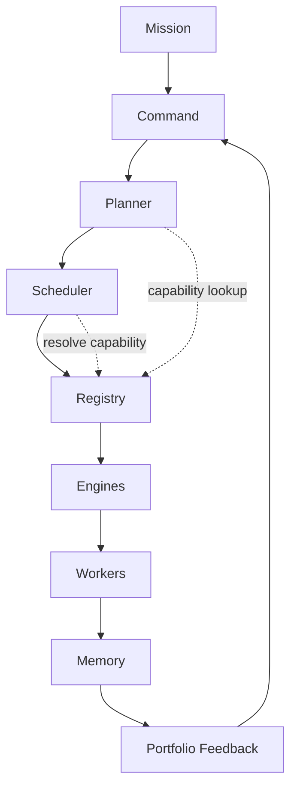

# Infinity OS Specification

| Field | Value |
| --- | --- |
| **Product** | Infinity |
| **System category** | Autonomous Venture Operating System |
| **Specification version** | 1.0 |
| **Status** | Architecture Freeze Candidate |
| **Repository** | `infinity-core` |
| **Date** | 2026-07-23 (amended: Registry layer; founding purpose) |

**Source of truth:** This document is the durable architectural source of truth for Infinity platform design, autonomous behavior, governance, and implementation sequencing. Product terminology, layer responsibilities, lifecycle stages, and security principles defined here are **locked** under Architecture Freeze v1 unless superseded by an approved ADR in `docs/decisions/`.

**Related documents:**

- [`infinity-architecture.md`](./infinity-architecture.md) — concise overview and navigation
- [`INFINITY_ARCHITECTURE.md`](./INFINITY_ARCHITECTURE.md) — historical Alpha schema reference (legacy table names)
- [`AGENTS.md`](../AGENTS.md) — Next.js 16 coding rules for this repository

---

## Table of Contents

1. [Core Purpose](#core-purpose)
2. [Section 1 — System Identity](#section-1--system-identity)
3. [Section 2 — Primary Hierarchy](#section-2--primary-hierarchy)
4. [Section 3 — Autonomous Lifecycle](#section-3--autonomous-lifecycle)
5. [Section 4 — Core Business Objects](#section-4--core-business-objects)
6. [Section 5 — Command](#section-5--command)
7. [Section 6 — Planner](#section-6--planner)
8. [Section 7 — Scheduler](#section-7--scheduler)
9. [Section 8 — Registry](#section-8--registry)
10. [Section 9 — Engines](#section-9--engines)
11. [Section 10 — Discovery Engine](#section-10--discovery-engine)
12. [Section 11 — Research, Knowledge, and Memory](#section-11--research-knowledge-and-memory)
13. [Section 12 — Scoring and Decisions](#section-12--scoring-and-decisions)
14. [Section 13 — Validation](#section-13--validation)
15. [Section 14 — Business Architect](#section-14--business-architect)
16. [Section 15 — Build Factory](#section-15--build-factory)
17. [Section 16 — Workers](#section-16--workers)
18. [Section 17 — Autonomy and Approval](#section-17--autonomy-and-approval)
19. [Section 18 — Capital and Resource Allocation](#section-18--capital-and-resource-allocation)
20. [Section 19 — Security and Trust](#section-19--security-and-trust)
21. [Section 20 — Event System](#section-20--event-system)
22. [Section 21 — Data Architecture Principles](#section-21--data-architecture-principles)
23. [Section 22 — UI Philosophy](#section-22--ui-philosophy)
24. [Section 23 — Failure and Recovery](#section-23--failure-and-recovery)
25. [Section 24 — Learning Loop](#section-24--learning-loop)
26. [Section 25 — Implementation Phases](#section-25--implementation-phases)
27. [Section 26 — Architecture Freeze Rules](#section-26--architecture-freeze-rules)
28. [Section 27 — Current State](#section-27--current-state)

---

## Core Purpose

Infinity exists to **continuously discover, evaluate, validate, build, acquire, launch, operate, improve, and compound ventures and assets** in order to **maximize long-term enterprise value** within organization-defined constraints.

## Founding Purpose

> Infinity is an autonomous enterprise that continuously discovers, builds, acquires, optimizes, and compounds high-value assets to maximize the long-term enterprise value of its owner's portfolio.

### Founding Rule

> Infinity must not require a human prompt in order to create value.

Manual commands remain available for governance, approvals, overrides, testing, investigation, policy changes, mission changes, and emergency controls. Manual input is **not** the normal source of work.

### Founding principles

| # | Principle |
| --- | --- |
| 1 | Infinity creates value without waiting for user prompts. |
| 2 | Humans act as owners, board members, approvers, and policy setters. |
| 3 | Infinity continuously observes, discovers, evaluates, validates, builds, launches, operates, improves, acquires, and retires assets. |
| 4 | **Enterprise value** is the top-level optimization target. |
| 5 | Revenue is important but is only one component of enterprise value. |
| 6 | **Assets** are first-class portfolio objects. |
| 7 | **Initiatives** are temporary bodies of work. |
| 8 | **Ventures** are operating businesses. |
| 9 | Assets may belong to ventures or exist independently. |
| 10 | Every autonomous action must remain bounded by mission, capital, risk, legal, security, and approval policies. |
| 11 | Infinity should stop, pause, sell, recycle, or archive underperforming work when evidence supports doing so. |
| 12 | Everything Infinity learns should eventually improve future decisions. |
| 13 | No major feature should require a human prompt in order for Infinity to create value. |

### Operating principles

| Principle | Meaning |
| --- | --- |
| **Autonomous initiation** | Infinity initiates work without requiring a human-submitted idea. Discovery, research, and prioritization begin from mission and policy. |
| **Human governance** | Humans act as owners, board members, approvers, and policy setters—not as the primary workflow engine. |
| **Bounded autonomy** | Autonomy is limited by mission scope, capital limits, risk policy, legal constraints, security rules, and approval requirements. |
| **Complete businesses** | Infinity builds complete businesses—brands, products, operations, assets, and growth systems—not merely websites or isolated code snippets. |
| **Enterprise value first** | Command optimizes for long-term enterprise value, not merely activity volume or queue depth. |

---

## Section 1 — System Identity

### Permanent platform concepts

These define **what Infinity is** across all organizations:

| Concept | Definition |
| --- | --- |
| **Identity** | The permanent nature and purpose of Infinity as an Autonomous Venture Operating System. |
| **Command** | Strategic intelligence; evaluates state and optimizes for enterprise value; decides priorities and outcomes—does not execute specialized work |
| **Planner** | Transforms Command decisions into structured, versioned plans. |
| **Scheduler** | Coordinates durable job execution with retries, locking, and recovery. |
| **Registry** | Authoritative catalog of available execution capabilities (engines, workers, builders, modules, providers). |
| **Engines** | Own broad domain capabilities (Discovery, Research, Build Factory, etc.). |
| **Workers** | Perform specialized tasks under engine and policy direction. |
| **Memory** | Preserves institutional knowledge, outcomes, and lessons across cycles. |
| **Portfolio** | Contains opportunities, initiatives, ventures, assets, capital, performance, and lessons. |

### Organization-specific concepts

These are **configured per organization** and may differ between tenants:

| Concept | Definition |
| --- | --- |
| **Organization** | Tenant boundary; all business data is scoped here. |
| **Mission** | Active strategic objective optimizing for long-term enterprise value (organization-specific content) |
| **Policies** | Autonomy, capital, legal, security, and approval rules for that organization. |
| **Portfolio composition** | Which ventures, assets, and opportunities exist for that organization. |

**Mission** is a permanent *concept* but each organization's mission content is organization-specific and versioned over time.

---

## Section 2 — Primary Hierarchy

```text
Identity
  → Mission
  → Command
  → Planner
  → Scheduler
  → Registry
  → Engines
  → Workers
  → Memory
  → Portfolio Feedback
```



| Layer | Responsibility | Primary inputs | Primary outputs | Must not |
| --- | --- | --- | --- | --- |
| **Identity** | Define system purpose and invariant principles | Platform specification | Architectural constraints | Vary by tenant |
| **Mission** | State active strategic objective | Owner/board direction, portfolio context | Mission record, constraints | Execute work directly |
| **Command** | Evaluate state; prioritize for enterprise value; decide; escalate | Mission, policies, portfolio, pipeline, memory | Decisions, priorities, plan requests, approvals | Perform specialized research, coding, design, or marketing; hardcode specific engines or workers |
| **Planner** | Structure work from decisions | Command decisions, constraints, Registry capability catalog | Versioned plans, milestones, dependencies, **abstract capability requirements** | Decide organization strategy |
| **Scheduler** | Run durable jobs reliably | Plans, capability requirements, Registry resolution | Job queue state, resolved engine/worker invocations | Judge strategic worth of opportunities |
| **Registry** | Catalog and expose execution capabilities | Capability registrations, health signals, policy bindings | Capability records, resolution metadata, availability status | Make strategic decisions, create plans, schedule jobs, or execute work |
| **Engines** | Own domain workflows end-to-end | Jobs, domain inputs, resolved capability bindings | Domain outputs, events, artifacts | Bypass Command policy or cross domain boundaries silently |
| **Workers** | Execute specialized tasks | Job payloads, tools | Outputs, costs, quality signals | Allocate capital outside policy |
| **Memory** | Store and retrieve institutional knowledge | Events, outcomes, evidence | Memory records, lessons | Present inference as verified fact |
| **Portfolio Feedback** | Aggregate performance and lessons | Metrics, venture state, capital | Portfolio signals to Command | Override explicit human approvals |

---

## Section 3 — Autonomous Lifecycle

### Permanent operating loop

```text
Observe → Discover → Research → Evaluate → Validate → Decide → Allocate → Plan → Build → Launch → Operate → Grow → Measure → Learn → Compound → Observe again
```

**Compound** means strengthening existing ventures; reusing proven assets; sharing knowledge across ventures; reallocating capital; creating distribution advantages; increasing brand, traffic, data, software, audience, revenue, and defensibility; and improving future discovery and build decisions.

| Stage | Purpose | Entry criteria | Output | Possible decisions | Owning engine | Audit | Failure outcomes | Human approval |
| --- | --- | --- | --- | --- | --- | --- | --- | --- |
| **Observe** | Gather external and internal signals | Mission active; observation policy enabled | Signal records, observation events | Continue, pause observation | Discovery (initial), Portfolio Intelligence (later) | `discovery.signal_observed` | Missed signals; stale data | Policy change only |
| **Discover** | Identify candidate opportunities | Signals or scan policy triggered | `opportunity_scans`, candidate `opportunities` | Queue research, discard duplicate | **Discovery Engine** | `discovery.scan_*`, `discovery.opportunity_found` | Scan failed; zero results | Scan budget override |
| **Research** | Collect evidence for candidates | Opportunity in `researching` or Command request | `opportunity_evidence`, knowledge candidates | Sufficient evidence, need more, contradict | **Research Engine** | `research.*` | Source unavailable; low credibility | Restricted source access |
| **Evaluate** | Assess enterprise value, fit, and risk | Research or portfolio signals available | Evaluation records, score inputs | Proceed, hold, reject path | **Command** (+ Decision Support) | `command.decision_created` | Incomplete evaluation | Policy change |
| **Validate** | Test critical assumptions cheaply | Command/decision to validate | Experiments, results, confidence updates | Pass, fail, inconclusive | **Validation Engine** | `validation.*` | Budget exhausted; invalid test | Experiment spend above threshold |
| **Decide** | Choose strategic path | Scores, validation, mission fit | Decision record on opportunity | reject, hold, validate, approve initiative, etc. | **Command** (+ Decision Support) | `command.decision_created` | Low confidence; policy block | Required for restricted outcomes |
| **Allocate** | Assign capital, attention, and capacity | Approved decision with budget envelope | Capital allocation records | Increase, reduce, pause | **Command** (+ Portfolio Intelligence) | `portfolio.allocation_*` | Insufficient capital | Required above threshold |
| **Plan** | Structure approved work | Approved initiative or build decision | Versioned plan, milestones | Replan, cancel | **Planner** | `planner.plan_created` | Infeasible plan; resource conflict | Major scope change |
| **Build** | Produce venture assets | Approved plan with build gate passed | Assets, artifacts, deployments | Continue, rollback, pause | **Build Factory** | `build.*` | Partial build; test failure | Production deploy, spend |
| **Launch** | Go live with controls | Build acceptance met | Launched venture, launch checklist | Launch, delay, abort | **Launch Engine** | `venture.launch_*` | Broken deploy; compliance gap | Public launch, legal filings |
| **Operate** | Run day-to-day business | Venture launched | Operational metrics, incidents | Optimize, pause, divest | **Execution Engine** | `venture.operating_*` | SLA breach; fraud signal | High-risk operational changes |
| **Grow** | Expand distribution and revenue | Operating venture with growth budget | Campaigns, experiments, content | Scale, stop campaign | **Growth Engine** | `growth.*` | Poor ROAS; channel ban | Ad spend, brand commitments |
| **Measure** | Capture performance truth | Active venture or initiative | Metrics, financial actuals | Continue measuring | Portfolio Intelligence | `portfolio.metric_updated` | Missing data; attribution error | None typically |
| **Learn** | Update institutional knowledge | Measured outcomes available | Lessons, memory updates, model feedback | Adjust policies, scoring weights | Memory + Command | `system.lesson_created` | Incorrect attribution | Policy approval for autonomy changes |
| **Compound** | Reinvest gains across the portfolio | Measured outcomes and active ventures/assets | Reuse plans, capital moves, shared assets | Strengthen, recycle, acquire, sell | **Command** + Portfolio Intelligence | `portfolio.compound_*` | Misallocated capital | Major portfolio moves |

---

## Section 4 — Core Business Objects

| Object | Definition |
| --- | --- |
| **Organization** | Tenant root; owns all business records and policies. |
| **Mission** | Active strategic objective with constraints and success criteria. |
| **Opportunity** | A potential business, asset, acquisition, partnership, product, market, or investment under evaluation—**before** initiative promotion. |
| **Evidence** | Source-backed material supporting or contradicting an opportunity (`opportunity_evidence`). |
| **Score** | Versioned multi-dimensional evaluation (`opportunity_scores`); never overwritten in place. |
| **Validation Experiment** | Structured test of a hypothesis with thresholds and budget. |
| **Decision** | Command (or approved delegate) outcome with reasoning, confidence, and policy reference. |
| **Initiative** | Approved or active **temporary body of work** (research, validation, build, launch prep). *Legacy table: `projects`.* |
| **Plan** | Versioned execution structure from Planner. |
| **Milestone** | Plan checkpoint with acceptance criteria. |
| **Job** | Durable Scheduler work unit. |
| **Engine Event** | Append-only audit record (`engine_events`). |
| **Worker Run** | Single worker execution with inputs, outputs, and cost. |
| **Venture** | Launched or **operating business**. *Legacy table: `companies`.* |
| **Asset** | **First-class portfolio primitive** — discrete created, acquired, owned, managed, improved, monetized, licensed, sold, retired, or reused item. Persisted in `assets` with relationships, metrics, and versioned valuations. May belong to a venture or exist independently. |
| **Deployment** | Release of an asset to an environment. |
| **Campaign** | Growth or validation go-to-market execution unit. |
| **Metric** | Measured performance datapoint. |
| **Experiment** | Generic test container (validation or growth). |
| **Capital Allocation** | Budget assignment to mission, initiative, experiment, or venture. |
| **Policy** | Rule governing autonomy, spend, or action classes. |
| **Approval** | Human authorization record for restricted actions. |
| **Lesson** | Institutional learning derived from outcomes. |
| **Knowledge Record** | Structured verified or labeled knowledge entry. |

### Asset primitive (implemented — Asset Foundation v1)

An **Asset** is a discrete item created, acquired, owned, managed, improved, monetized, licensed, sold, retired, or reused by Infinity.

**Tables:** `assets`, `asset_relationships`, `asset_metrics`, `asset_valuations`

**Planned asset categories** (non-exhaustive): domain, brand, website, ecommerce store, SaaS application, mobile application, API, database, dataset, AI model, AI worker, automation, content library, article, video, image library, newsletter, email list, social account, community, marketplace, directory, course, book, intellectual property, patent, trademark, customer list, ad account, analytics property, CRM, codebase, infrastructure, legal entity, contract, partnership, acquisition, other.

**Relationships:** explicit edges between assets (`owns`, `depends_on`, `powers`, `monetizes`, etc.)

**Metrics:** append-only time-series measurements (`monthly_revenue`, `traffic`, `active_users`, …)

**Valuations:** versioned valuation records; projected vs verified remain distinct; history is never overwritten in place.

**Registration seam:** server-side `registerAsset()` for future engines (Build Factory, acquisition systems). No manual asset form in v1; no seed assets.

**Not yet implemented:** external account provisioning, domain purchasing, automated valuation models, acquisition/sale workflows, **public deployment and asset launch** (internal Build Factory v2 sandbox builds and snapshots are implemented).

### Asset examples (conceptual)

A **venture** may own many **assets**, and assets may also exist independently of a single venture.

### Promotion path

```text
Opportunity → (Decision: approve initiative) → Initiative → (Build + Launch) → Venture → Assets
```

---

## Section 5 — Command

Command is the **central strategic intelligence layer**. It optimizes for **long-term enterprise value**, not merely queue activity or manual user requests. It does not perform specialized execution.

### Enterprise-value evaluation dimensions

Command should eventually evaluate, among others:

- expected enterprise value
- capital efficiency
- recurring revenue potential
- cash-flow potential
- strategic fit
- defensibility
- distribution advantage
- asset reuse
- portfolio synergy
- time to value
- downside risk
- operational burden
- learning value
- exit or acquisition value

The current deterministic implementation preserves the existing discovery-job rule while tying discovery decisions explicitly to the active enterprise-value mission and portfolio opportunity flow.

### Responsibilities

- Evaluate the active mission against **enterprise value** objectives
- Observe system state across portfolio and pipeline
- Identify strategic gaps and bottlenecks
- Prioritize opportunities and initiatives
- Allocate attention and **recommended** capital (subject to policy and approval)
- Request plans from Planner
- Approve actions permitted by autonomy policy
- Escalate restricted actions to humans
- Pause, terminate, recycle, sell, or archive unproductive work when evidence supports it
- Monitor portfolio outcomes
- Trigger learning cycles

### Inputs

Mission, policies, portfolio state, opportunity pipeline, initiative state, venture performance, capital availability, worker/engine capacity, risk signals, external observations, institutional memory.

### Outputs

Decisions, priorities, planning requests, approvals, escalations, pauses, cancellations, capital recommendations, **outcome and priority directives** (not hardcoded engine or worker selections).

### Command and capability selection

Command requests **outcomes, priorities, constraints, and budgets**—not specific engines, workers, builders, or model providers. Examples:

- "Validate demand for opportunity X within $500 and 14 days" — not "run Landing Page Worker v3 on Vercel."
- "Prioritize research on top three SaaS opportunities" — not "invoke Research Engine with OpenAI GPT-4."

Planner and Scheduler resolve **how** through the Registry. Command may set policy preferences (e.g., "no unapproved external APIs") but does not bypass Registry resolution for execution binding.

### Command cycles

A **Command cycle** is a bounded evaluation pass: ingest state → analyze → produce decision records → emit events. Each cycle records:

- **Confidence** (0–100 or enumerated)
- **Reasoning** (structured text + references)
- **Evidence references** (links to evidence IDs, scores, metrics)
- **Mission objective**, portfolio-value rationale, expected outcome, and policy context in structured payloads where applicable
- **Audit trail** (`command.cycle_started`, `command.decision_created`)

Command must never overwrite prior decisions; new decisions append with supersession references where applicable.

---

## Section 6 — Planner

Planner converts a **Command decision** into an executable structure.

### Plan contents

- Objectives and success criteria
- Workstreams and dependencies
- Milestones and acceptance criteria
- **Required capabilities** (abstract requirements: capability type, constraints, quality/cost/latency bounds—not hardcoded engine or worker IDs)
- Budget and timeline estimates
- Risk controls and approval gates
- Rollback strategy
- Measurable outcomes

### Registry integration

When Planner structures a plan, it **queries the Registry** to determine which capabilities can satisfy each requirement. Planner records:

- **Capability requirements** — e.g., `research.market_analysis`, `build.saas.frontend`, `worker.copywriter`
- **Constraints** — max cost, required approval level, allowed providers, minimum quality tier
- **Fallback options** — alternate capabilities if primary is unavailable or unhealthy

Planner **must not** embed implementation-specific bindings (model name, API vendor, worker version) unless explicitly mandated by an approved policy override. Scheduler performs final resolution at job execution time using current Registry health and availability.

### Versioning and replanning

Plans are **versioned**. When conditions change (validation failure, budget cut, new evidence), Planner produces a new plan version; Scheduler migrates or cancels affected jobs per policy.

Planner **must not** decide whether an opportunity is strategically worthwhile—that is Command's role.

---

## Section 7 — Scheduler

Scheduler provides **durable job orchestration** between Planner and Engines/Workers, using the **Registry** to resolve abstract capability requirements into executable bindings.

### Registry integration

When Scheduler dequeues a job, it:

1. Reads the job's **capability requirement** from the plan (not a hardcoded engine/worker name from Command)
2. **Queries the Registry** for matching capabilities filtered by health, version, policy, and organization scope
3. **Resolves** to a concrete engine, worker, builder, or hybrid workflow binding
4. Records the resolution (capability ID, version, provider) on the job and worker run for audit
5. **Re-resolves** on retry if the primary capability is disabled, unhealthy, or deprecated—subject to plan fallback rules

If no capability satisfies the requirement within policy, the job enters a **waiting** or **blocked** state and emits an escalation event—not silent failure.

### Capabilities

| Capability | Description |
| --- | --- |
| Queued jobs | Persistent queue with priority |
| Dependencies | Job B waits for Job A |
| Locking | Prevent duplicate concurrent execution |
| Idempotency | Safe retries with idempotency keys |
| Retries / backoff | Configurable retry policy |
| Timeouts | Kill hung work |
| Cancellation | Cooperative cancel signals |
| Waiting states | Block on external events |
| Dead-letter | Quarantine repeatedly failed jobs |
| Recovery | Manual or automatic replay |
| Concurrency limits | Per org, engine, worker |
| Resource limits | Budget and rate caps |
| Parent-child jobs | Decompose plan execution |
| Scheduled / event / recurring | Cron, webhooks, internal events |

### Distinctions

| Term | Meaning |
| --- | --- |
| **Plan** | Strategic structure from Planner (what and why; includes abstract capability requirements) |
| **Job** | Scheduler unit of durable work (when and how orchestrated; includes resolved capability binding) |
| **Worker run** | Single execution attempt by a worker |
| **Engine event** | Audit record of engine-level activity |

---

## Section 7A — Mission Runtime (Foundation v1)

Mission Runtime is the **durable lifecycle owner** for active missions. It sits between **Command** (strategic intent) and **Scheduler/Worker Runtime** (execution).

| Rule | Requirement |
| --- | --- |
| Lifecycle owner | Mission Runtime advances stages; modules do not call the next stage directly |
| Bounded ticks | Each `runMissionRuntimeTick` processes a limited batch; each `advanceMissionRuntime` performs at most one durable transition |
| Durability | Instances, append-only transitions, immutable checkpoints |
| Locking | Atomic claim via `claim_mission_runtime_instance` (service_role); lease expiry enables recovery |
| Gates | Validation (`approved_for_planning`), Executive, and Planner gates enforced in stage handlers |
| Executive → Planner (v1) | Canonical source: immutable `executive_selection_decisions` with `select_for_planning` + `planning_eligible` + independent QA passed. Legacy `executive_decisions` remain for v1 initiative reads via `PlannerExecutiveAuthorization` adapter — not duplicated as a second source of truth. Runtime **executive** stage waits on pending Executive jobs/QA/escalation; advances to **planning** on a later tick only. **Planning** stage runs `planner_executive_handoff` once (idempotent); Planner verifies authorization and creates exactly one durable plan (bounded steps, plan QA, no build/deploy/publish/venture). Runtime observes the plan on a subsequent tick before allocation. |
| AI | **Governed advisory reasoning** (`lib/infinity/governed-reasoning/`): modes `mock`, `shadow`, `advisory`, `disabled` (default **disabled**). OpenAI is the first real provider (`lib/infinity/ai-providers/openai/`, Responses API + strict JSON schema). Output is **advisory only** — Validation, Executive, Planner gating, and Mission Runtime remain authoritative. No chain-of-thought persistence. Server-only `OPENAI_*` secrets. |
| Build Factory | **Runtime v2 implemented** for governed **internal** builds (`requestBuildFactoryRuntimeV2`, generic `build_jobs`, Builder Registry adapters). Existing website builders are registered adapters (`website.internal_*`). Scheduler + Worker Runtime execute `build.*` / `website.*` / QA in sandboxes. **Public deployment, publishing, domains, hosting, and launch remain unimplemented.** Internal completion (`internally_complete`) is not deployed, live, or revenue-generating. |

**Stages (sequential, v2):** command → discovery → evaluation → validation → reasoning → executive → planning → allocation → scheduling → execution → review → completed.

**Status (orthogonal):** draft, ready, running, waiting, blocked, paused, completed, failed, cancelled, archived.

Production deployment will invoke bounded ticks via cron/queue; development UI at `/dashboard/runtime` and read-only `/dashboard/reasoning` are not the normal operating model.

### Governed Reasoning Cycle (OpenAI v1)

| Item | Detail |
| --- | --- |
| Capability | `reasoning.execute_advisory` (durable worker) |
| Persistence | `reasoning_sessions` (immutable when completed; idempotent by org + idempotency key) |
| Contract | `governed_reasoning_v1` structured output (findings, risks, opportunities, recommendation enum) |
| Modes | `AI_REASONING_MODE`: mock (offline), shadow (record only), advisory (Executive may review), disabled |
| Safety | No tools, no browsing, no Build Factory, no ventures/assets/deployments; cost and token policy blocks before provider call |
| Events | `reasoning.session_*`, `reasoning.executive_review_requested` (no API keys in payloads) |

---

## Section 8 — Registry

The **Registry** is Infinity's **authoritative catalog of available execution capabilities**. It sits between Scheduler and Engines: Scheduler asks the Registry *what can run*; Engines and Workers *run* what the Registry describes.

The Registry does **not** make strategic decisions, create plans, schedule jobs, or execute work.

### Purpose

Provide a single, queryable source of truth for every execution capability Infinity may invoke—so Planner can structure feasible plans and Scheduler can bind jobs to healthy, policy-compliant implementations without hardcoding vendors or versions in Command decisions.

### Questions the Registry answers

- Which engines are available?
- Which workers are available?
- Which builders are available?
- Which capability modules can satisfy a plan requirement?
- Which versions are active?
- Which capabilities are healthy?
- Which capabilities require approval?
- Which providers or models can execute a capability?
- What inputs and outputs does each capability support?
- What cost, risk, latency, and quality characteristics are known?

### Responsibilities

- Register, update, and deprecate capabilities
- Expose capability discovery and lookup APIs (server-side)
- Track versioning and active/default version per capability
- Maintain health status and availability signals
- Attach policy requirements (approval level, autonomy class, spend caps)
- Store cost, quality, latency, and risk metadata
- Map providers, models, adapters, and deployment targets to capabilities
- Support organization-scoped capability visibility where applicable
- Emit audit events on registration and status changes

### Inputs

- Capability registration payloads (from engine/worker/builder implementations at deploy or bootstrap)
- Health check results and heartbeat signals
- Policy bindings from organization configuration
- Performance and cost telemetry from worker runs and Memory
- Deprecation and disable directives from operators or automated governance

### Outputs

- Capability records (searchable catalog entries)
- Resolution results for Planner feasibility checks and Scheduler binding
- Health and availability status
- Version metadata (active, deprecated, superseded)
- Policy requirement summaries per capability
- Events (`registry.*`)

### Prohibited responsibilities

| Prohibited | Reason |
| --- | --- |
| Strategic decisions | Command's role |
| Plan creation | Planner's role |
| Job scheduling and execution | Scheduler's and Engines' roles |
| Performing specialized work | Workers' role |
| Overriding Command priorities | Registry is descriptive, not prescriptive |
| Allocating capital | Finance/policy layers; Registry only exposes cost metadata |

### Registrable capability types

The Registry must support future registration of:

- Engines
- Workers
- Builders (Build Factory families)
- Capability modules (reusable build/execution modules)
- Model providers
- API adapters
- Source adapters (Discovery and Research)
- Deployment targets
- Tools
- Human-review capabilities
- Hybrid workflows

### Capability discovery

Capabilities are identified by **stable capability keys** (e.g., `discovery.scan`, `research.web_evidence`, `build.saas`, `worker.developer`) with optional tags, input/output schemas, and constraint metadata. Planner and Scheduler query by:

- Capability type and key patterns
- Required input/output compatibility
- Policy and approval requirements
- Health and availability
- Cost, latency, and quality bounds
- Organization scope and entitlements

### Versioning

Each capability may have multiple **versions**. The Registry tracks:

- **Active version** — default for new job resolution
- **Supported versions** — still executable for in-flight jobs
- **Deprecated versions** — no new bindings; existing jobs may complete or migrate
- **Superseded-by** links — audit trail when versions change

Version changes emit `registry.capability_updated` or `registry.version_deprecated`. Scheduler must not bind deprecated capabilities to new jobs unless explicitly allowed by policy.

### Health status

| Status | Meaning |
| --- | --- |
| `healthy` | Available for new bindings |
| `degraded` | Available with reduced quality/latency expectations; may prefer fallbacks |
| `unhealthy` | Not available for new bindings; retries may re-resolve |
| `disabled` | Administratively off; no bindings |
| `unknown` | Insufficient telemetry; treat as unavailable for autonomous binding |

Health transitions emit `registry.health_changed`.

### Policy requirements

Each capability record may declare:

- Minimum autonomy level required
- Approval gates (e.g., external communication, deployment, spend threshold)
- Allowed organization tiers or feature flags
- Restricted data access classes
- Prohibited action categories

Scheduler and Engines must enforce policy **before** invocation; Registry exposes requirements for pre-flight checks.

### Cost metadata

Estimated and observed cost characteristics per capability/version: unit cost model (per run, per token, per minute), typical range, currency, budget category. **Estimates are not verified financial results**—actuals come from worker runs and Finance Engine.

### Quality metadata

Historical and declared quality signals: success rate, review pass rate, confidence calibration, error rate, output acceptance rate. Memory feeds observed quality back into Registry metadata over time.

### Provider metadata

For AI, API, and infrastructure capabilities: provider name, model or service identifier, region, rate limits, credential scope reference (not secrets), adapter version. Enables Scheduler fallback across providers when policy allows.

### Availability

Capabilities may be globally available, organization-scoped, or environment-scoped (development/staging/production). Availability windows and concurrency limits may apply. Unavailable capabilities are excluded from resolution unless plan specifies a mandatory wait.

### Deprecation

Deprecation is **explicit and auditable**. Deprecated capabilities remain in the catalog for history and in-flight job completion but are excluded from default Planner feasibility and Scheduler resolution. Removal from the catalog requires supersession or ADR; records are not silently deleted.

### Build Factory registration

Build Factory **builder families** (SaaS, Ecommerce, Marketplace, etc.) and **reusable capability modules** (brand, frontend, billing, deployment, etc.) are registered in the Registry as first-class capabilities:

| Registration type | Example key | Notes |
| --- | --- | --- |
| Builder family | `build.saas` | Composes modules; declares venture asset outputs |
| Capability module | `build.module.authentication` | Reusable across builder families |
| Deployment target | `deploy.vercel` | Target environment binding |

Build Factory implementations register at deploy time; Planner references builder/module **capability keys** in plans; Scheduler resolves to the active builder version and module set via Registry.

---

## Section 9 — Engines

| # | Engine | Purpose | Key outputs | Stage |
| --- | --- | --- | --- | --- |
| 1 | **Discovery Engine** | Autonomous opportunity discovery | scans, opportunities | **Data foundation done** |
| 2 | **Research Engine** | Evidence collection and synthesis | evidence, findings | Planned |
| 3 | **Knowledge Engine** | Structured reusable knowledge | knowledge records | Planned |
| 4 | **Scoring Engine** | Multi-dimensional opportunity scoring | score versions | Planned |
| 5 | **Validation Engine** | Hypothesis testing | experiments, results | Planned |
| 6 | **Decision Support Engine** | Analysis for Command decisions | recommendations (labeled) | Planned |
| 7 | **Business Architect** | Venture blueprint | architecture artifacts | Planned |
| 8 | **Build Factory** | Asset production and integration | assets, deployments | **Partial (internal v2)** — governed internal builds; deploy/publish not implemented |
| 9 | **Launch Engine** | Controlled go-live | launch records | Planned |
| 10 | **Execution Engine** | Ongoing operations | operational tasks | Planned |
| 11 | **Growth Engine** | Distribution and revenue growth | campaigns, experiments | Planned |
| 12 | **Finance Engine** | Financial modeling and tracking | models, actuals | Planned |
| 13 | **Risk and Compliance Engine** | Risk identification and controls | risk records, blocks | Planned |
| 14 | **Portfolio Intelligence** | Cross-venture analytics | portfolio metrics, allocation signals | Planned |

For each engine (future implementation specs must define): accepted inputs, produced outputs, owned objects, permitted workers, dependencies, **prohibited responsibilities**, key audit events.

**Prohibited example:** Discovery Engine must not approve initiatives or deploy production assets.

---

## Section 10 — Discovery Engine

Discovery Engine performs **autonomous opportunity discovery**. It must **not** rely solely on user-entered ideas.

### Future source categories

Market trends, search behavior, customer complaints, social discussions, product demand, competitor weaknesses, regulatory changes, technology shifts, new APIs, AI capabilities, pricing changes, funding movements, acquisitions, domain opportunities, partnerships, geographic gaps, operational inefficiencies, portfolio data.

### Core concepts

| Concept | Definition |
| --- | --- |
| **Scan** | One discovery run (`opportunity_scans`) |
| **Signal** | Raw observation that may become evidence or trigger scans |
| **Candidate opportunity** | Provisional opportunity before deduplication and scoring |
| **Duplicate detection** | Merge or reject near-duplicate opportunities within org |
| **Evidence threshold** | Minimum material required before promotion to research/scoring |
| **Discovery policy** | Org rules for scan frequency, sources, and budgets |
| **Provenance** | Source, timestamp, adapter, and credibility metadata |
| **Contradiction handling** | Conflicting signals reduce confidence; never hidden |

### Implemented tables (legacy names)

`opportunity_scans`, `opportunities`, `opportunity_evidence`, `opportunity_scores`, `engine_events`.

---

## Section 11 — Research, Knowledge, and Memory

| System | Role |
| --- | --- |
| **Research Engine** | Collects and analyzes information for a **specific objective** (usually one opportunity or initiative). |
| **Knowledge Engine** | Structures **verified and reusable** knowledge across opportunities. |
| **Memory** | Stores institutional **history**: decisions, outcomes, failures, lessons, performance patterns. |

### Implemented primitives (Evidence, Knowledge, and Memory Foundation v1)

| Primitive | Table(s) | Purpose |
| --- | --- | --- |
| **Evidence source** | `evidence_sources` | Provenance and reliability of information origins |
| **Evidence** | `evidence_records` | Raw or processed information supporting/contradicting claims |
| **Claim** | `claims`, `claim_evidence` | Specific assertions with support/contradiction links |
| **Knowledge** | `knowledge_records` | Structured reusable conclusions (versioned, supersession preserved) |
| **Memory** | `memory_records` | Append-only institutional history |
| **Lesson** | `lessons` | Distilled learning from outcomes |
| **Procedure** | `procedures` | Reusable operational patterns |

Server-side services in `lib/infinity/intelligence/` write intelligence records via the admin client. Browser clients have **read-only** access.

**Current limitation:** deterministic discovery runtime records **system-validation evidence only** (not real market intelligence). Autonomous observation, external source adapters, embeddings, and AI synthesis remain future work.

### Memory categories

Semantic, episodic, procedural, portfolio, venture, worker performance, source reliability, decision outcome.

### Epistemic separation (mandatory)

| Class | Treatment |
| --- | --- |
| Verified facts | May be used as evidence |
| Estimates | Labeled with assumptions |
| Assumptions | Explicit and revisitable |
| AI inferences | **Never presented as verified** |
| Opinions | Labeled and low default weight |
| Unknowns | Explicit gaps |
| Contradicted claims | Preserved with contradiction links |

Every learned conclusion preserves **provenance** and **confidence**.

---

## Section 12 — Scoring and Decisions

### Scoring dimensions (extensible)

Demand, competition, profitability, startup cost, time to revenue, automation potential, distribution difficulty, SEO opportunity, AI-search opportunity, defensibility, scalability, operational complexity, regulatory risk, capital efficiency, strategic fit, portfolio synergy, validation strength, confidence.

**Scoring versions must be preserved** (`opportunity_scores.scoring_version`). Do not overwrite prior scores.

### Decision outcomes

reject, hold, research more, validate, approve initiative, approve build, acquire, partner, monitor.

**Command** applies decisions using **mission and policy**—not a single universal score threshold.

---

## Section 13 — Validation

Validation proves critical assumptions **as cheaply and quickly as practical** before major capital allocation.

### Methods (non-exhaustive)

Customer interviews, landing pages, waitlists, presales, outbound, paid traffic tests, keyword analysis, prototypes, pricing tests, marketplace tests, content tests, supplier checks, legal checks, technical feasibility tests.

### Experiment requirements

Hypothesis, assumption tested, method, budget, success threshold, failure threshold, duration, result, confidence impact, next decision recommendation.

---

## Section 14 — Business Architect

Transforms an **approved opportunity** into a **complete venture blueprint**.

Outputs may include: business model, target customer, positioning, offer, pricing, product/brand/technical/data architecture, monetization, acquisition/retention strategy, legal requirements, operational model, fulfillment, worker model, financial model, risk controls, launch plan, growth plan, **asset map**.

---

## Section 15 — Build Factory

Build Factory is an **asset production and integration system**—not merely code generation.

It creates, configures, connects, tests, and deploys assets required by a venture. Builder families and reusable modules are **registered in the Registry** (see [Section 8](#section-8--registry)); plans reference capability keys, not hardcoded implementation paths.

### Builder families

SaaS, Ecommerce, Marketplace, Affiliate, Media, Directory, Course, Community, Newsletter, Mobile App, AI Tool, Browser Extension, Local Service, Custom.

### Reusable capability modules

Brand, domain, frontend, backend, database, authentication, billing, ecommerce, catalog, content, SEO, analytics, CRM, email, social, ads, support, legal pages, deployment, monitoring.

### Requirements

Artifact versioning, acceptance tests, rollback procedures, ownership records, deployment records.

**Runtime v2 (implemented foundation):** `lib/infinity/build-factory/` extends v1 with product-neutral `build_jobs`, server-seeded `builder_registry_entries`, `requestBuildFactoryRuntimeV2`, BuilderPlugin adapters (`website.internal_*` wrap Website Build Worker v1), dual QA (`qa.verify_generic_internal_build` + product QA), bounded repair, rollback mode disclosure (`metadata_only` default). Internal completion only — no deploy, publish, shell, network, or package install.

---

## Section 16 — Workers

Workers are **specialized execution units** registered in the Registry and invoked by Engines via Scheduler.

Examples: Research Worker, Market Analyst, Developer, Architect, Designer, Copywriter, SEO Worker, GEO Worker, Paid Media Worker, Social Worker, Sales Worker, Finance Worker, Legal Review Worker, Security Worker, QA Worker, Deployment Worker, Customer Success Worker.

Workers may be: deterministic software, AI model calls, external APIs, human operators, or hybrid workflows.

### Worker run record (required)

Worker identity, model/implementation version, inputs, outputs, cost, duration, confidence, errors, reviewed status, related job, produced assets, quality result.

---

## Section 17 — Autonomy and Approval

### Autonomy levels

| Level | Meaning |
| --- | --- |
| `observe_only` | Collect and analyze only |
| `approval_required` | Propose; human must approve before action |
| `bounded_autonomy` | Auto-execute within defined caps |
| `full_autonomy` | Auto-execute within mission scope (rare; heavily policy-bound) |

### Policy categories

Capital, legal, security, brand, external communication, purchasing, deployment, data access, account creation, contracts, refunds, hiring, acquisitions, autonomous spend, validation budgets, build budgets, acquisition budgets, allowed and prohibited industries, jurisdictions, domain purchasing, infrastructure purchasing, paid advertising, public publishing, outbound communication, legal commitments, shutdown and asset disposal.

Policies govern autonomous value creation. They must **not** grant unrestricted autonomy.

### Examples

- **Bounded autonomy:** Run a $25 landing-page validation test automatically.
- **Approval required:** Sign contracts, open bank accounts, acquire companies, incur significant legal obligations, production deployments with customer data.

Autonomy is **organization-specific, mission-specific, action-specific, and budget-specific**.

---

## Section 18 — Capital and Resource Allocation

**Foundation v1 (implemented):** `resource_pools` bootstrap with zero capacity (no fake balances), `allocation_proposals` with policy-blocked and awaiting-approval states, and `resource_reservations` with atomic capacity checks via SQL functions. Proposals are created from evaluation recommendations (`validate`, `approve_initiative`) but do not connect to payment providers or real bank accounts.

Infinity evaluates: available/reserved capital, experiment/build/operating/acquisition budgets, **expected enterprise value**, capital efficiency, downside exposure, opportunity cost, portfolio concentration, worker/API/infrastructure cost, payback period, and portfolio synergy.

### Enterprise value framework

Enterprise value inputs may include: recurring revenue, gross margin, net cash flow, growth rate, retention, customer concentration, organic traffic, search authority, AI-search visibility, audience size, email list quality, brand strength, intellectual property, software assets, data assets, automation, operational leverage, defensibility, market position, strategic relationships, portfolio synergy, owner dependency, legal and regulatory risk, capital requirements, and liquidation or resale value.

**Rules:**

- Projected enterprise value is an **estimate**; verified financial results must remain distinct from projections.
- Valuation models must be **versioned**.
- Command must **not** rely on one universal valuation formula.
- Different asset and venture types require different valuation models.
- Revenue is one component of enterprise value, not the sole optimization target.

**All financial projections must distinguish estimates from verified results.**

---

## Section 19 — Security and Trust

| Principle | Requirement |
| --- | --- |
| Privileged execution | Server-side only; no service-role keys in browser |
| Tenant isolation | Organization scoping + RLS on all business tables |
| Least privilege | Role-based access; minimal worker permissions |
| Auditability | Engine events; immutable decision history where appropriate |
| Secret management | Encrypted credentials; never in client bundles |
| Provenance | Source tracking for evidence and knowledge |
| Human override | Pause, kill, and approval verification |
| Spending limits | Org-configured caps enforced before execution |
| Recoverability | Jobs and deployments support rollback and replay |

Autonomous execution must be **observable, interruptible, auditable, and recoverable**.

---

## Section 20 — Event System

### Event families

`mission.*`, `command.*`, `planner.*`, `scheduler.*`, `registry.*`, `discovery.*`, `research.*`, `scoring.*`, `validation.*`, `initiative.*`, `build.*`, `asset.*`, `venture.*`, `worker.*`, `growth.*`, `portfolio.*`, `approval.*`, `policy.*`, `system.*`

### Example events

`command.cycle_started`, `command.decision_created`, `discovery.scan_started`, `discovery.opportunity_found`, `research.evidence_added`, `scoring.completed`, `validation.experiment_completed`, `initiative.approved`, `build.asset_created`, `venture.launched`, `worker.failed`, `portfolio.metric_updated`

### Registry events

`registry.capability_registered`, `registry.capability_updated`, `registry.capability_disabled`, `registry.health_changed`, `registry.version_deprecated`

Registry events follow the same payload requirements as all canonical events.

### Payload requirements

Organization ID, timestamp, actor (user/system/worker), entity type and ID, correlation ID (when part of a chain), structured JSON payload.

Implemented table: `engine_events` (foundation; naming conventions evolve toward canonical families above).

---

## Section 21 — Data Architecture Principles

| Principle | Rule |
| --- | --- |
| Organization scoping | Every business row carries `organization_id` |
| UUID identifiers | Primary keys use UUID |
| Append-only history | Scores, decisions, events where valuable |
| Versioning | Plans and scores are versioned, not overwritten |
| Flexible JSON | Only where schemas are genuinely variable |
| Normalized relationships | Core FK graph; JSON for extensibility |
| Text states + CHECK | Prefer CHECK over PostgreSQL enums for extensibility |
| Schema changes | Migration-only; no ad hoc production DDL |
| RLS by default | All tenant tables enable RLS |
| Browser writes | No direct browser writes to protected execution records |
| TypeScript types | Generated from Supabase schema |
| Idempotency | Autonomous operations must be safely retriable |

### Implemented tables

| Table | Product mapping |
| --- | --- |
| `organizations` | Organizations |
| `organization_members` | Membership |
| `profiles` | User profiles |
| `projects` | **Initiatives** (legacy name) |
| `companies` | **Ventures** (legacy name) |
| `opportunity_scans` | Discovery scans |
| `opportunities` | Opportunities |
| `opportunity_evidence` | Evidence |
| `opportunity_scores` | Score versions |
| `engine_events` | Engine audit stream |

### Planned (not yet migrated)

Missions, Command cycles, plans, milestones, jobs, worker runs, **Registry capability records**, assets, deployments, campaigns, metrics, experiments, capital allocations, policies, approvals, lessons, knowledge records, validation experiments.

Conceptual relationships:

```text
Organization
  ├── Mission
  ├── Opportunity → Evidence → Score
  ├── Initiative (projects) → Plan → Job → Registry resolution → Worker Run
  ├── Venture (companies) → Asset → Deployment
  └── Portfolio metrics / Lessons
```

---

## Section 22 — UI Philosophy

The UI is an **observability, governance, approval, and portfolio-control layer**—not the primary engine of autonomous operation.

### Future dashboard surfaces

Mission, Command summary, approvals pending, discoveries, research in progress, validation experiments, initiatives, ventures, assets, portfolio value, revenue, profit, capital allocation, risk alerts, worker activity, **Registry capability health**, system health, lessons learned.

### Design rule

The UI **must not imply** that manual data entry is required for Infinity to operate.

Manual controls exist for: override, testing, approval, policy, mission setting, investigation, and direct commands—not for feeding the discovery pipeline.

---

## Section 23 — Failure and Recovery

| Failure | Responses |
| --- | --- |
| Failed jobs | Retry → backoff → dead-letter → human review |
| Partial builds | Rollback → quarantine assets → replan |
| Contradictory evidence | Reduce confidence; Command review |
| Unreliable sources | Downgrade source reliability memory |
| Model hallucination | Label inference; block auto-decisions |
| Duplicate opportunities | Merge or reject; audit dedup decision |
| Broken deployments | Rollback; incident event |
| Budget exhaustion | Pause work; escalate to Command |
| Policy violation | Block action; approval request |
| Stalled initiatives | Command reprioritize or cancel |
| Low-confidence decisions | Hold or validate more |
| External API failure | Retry; alternate adapter |
| Lost locks | Timeout recovery; idempotent retry |
| Repeated worker failure | Escalate; disable worker version via Registry |
| Unhealthy capability | Scheduler re-resolve fallback; `registry.health_changed` |
| Deprecated capability on job | Complete in-flight or migrate; block new bindings |

Actions: retry, escalation, pause, rollback, quarantine, dead-letter, human review, cancellation, lesson creation.

---

## Section 24 — Learning Loop

Infinity compares predictions to actuals:

| Comparison | Feeds |
| --- | --- |
| Predicted vs actual demand | Scoring model feedback |
| Predicted vs actual cost | Capital policy tuning |
| Predicted vs actual time | Planner estimates |
| Predicted vs actual revenue | Portfolio intelligence |
| Predicted vs realized risks | Risk engine |
| Validation vs launch results | Validation design |
| Worker confidence vs quality | Worker selection; **Registry quality metadata** |
| Source credibility vs verification | Source reliability memory |

Historical models and scoring versions are **preserved**—past decisions are not rewritten.

---

## Section 25 — Implementation Phases

| Phase | Scope |
| --- | --- |
| **1 — Foundation** | Auth, organizations, protected dashboard, Supabase, migrations, Discovery data foundation |
| **2 — Command and Orchestration** | Missions, Command cycles, durable jobs, events, secure execution, manual dev trigger, scheduler seam |
| **3 — Planner, Scheduler, and Registry** | Plans, milestones, dependencies, job execution, retries, locking, recovery, **capability catalog, registration, health, resolution** |
| **4 — AI-Assisted Discovery** | Source adapters, AI synthesis, autonomous scans, opportunity creation, provenance |
| **5 — Research, Knowledge, Scoring** | Evidence automation, knowledge records, scoring versions, contradiction handling |
| **6 — Validation and Decisions** | Experiments, approval policies, initiative promotion |
| **7 — Business Architect** | Venture blueprint, asset map, launch/financial/risk plans |
| **8 — Build Factory** | First builder, reusable modules, artifact tracking, deployment, **Registry registration of builders and modules** |
| **9 — Execution and Growth** | Workers, campaigns, metrics, optimization, **worker registration and quality feedback to Registry** |
| **10 — Portfolio Intelligence** | Capital allocation, cross-venture learning, acquisitions/partnerships |

**Current position:** Phase 1 complete (Discovery schema foundation). Phase 2 OS Foundation and durable execution runtime substantially implemented in `infinity-core` (missions, Command, Planner, Scheduler seam, Registry seed, Worker Runtime, deterministic discovery scan, development Command controls, **Build Factory Runtime v2 for internal builds**). Continuous autonomous observation, external evidence, **public deployment/launch**, and Memory remain future phases.

---

## Section 26 — Architecture Freeze Rules

### Locked under Freeze v1

- Product terminology (Mission, Command, Planner, Scheduler, **Registry**, Engines, Workers, Opportunities, Initiatives, Ventures, Assets, Discovery Engine, Build Factory)
- **Founding purpose** and **Founding Rule** (autonomous value creation without prompts)
- **Enterprise value** as the top-level optimization goal
- **Assets** as a first-class portfolio primitive (specified; persistence is next)
- **Permanent operating loop** including **Compound**
- Layer responsibilities and separation (Command ≠ Planner ≠ Scheduler ≠ **Registry** ≠ Engines)
- **Registry** as authoritative capability catalog between Scheduler and Engines; Registry does not decide, plan, schedule, or execute
- Distinction between Opportunities, Initiatives, Ventures, and Assets
- Autonomous lifecycle stages
- Organization-scoped security model (RLS, no browser service role)
- Durable job and event principles
- Human governance, bounded autonomy, and humans as governors rather than routine operators
- Ability to pause, terminate, recycle, acquire, and sell assets when evidence supports it
- Epistemic separation (inference ≠ fact)
- Command requests **outcomes and priorities**, not hardcoded engine/worker bindings

### Remains flexible

- Implementation language and framework details
- Cloud providers and hosting
- Specific AI models and vendors
- Source adapters and data vendors
- Queue technology (in-process → external broker when justified)
- Scoring weights and formulas
- Builder templates and module library internals
- UI presentation and layout
- Future engine additions (must not violate layer boundaries)

Changes to **locked** items require an ADR and specification version bump.

---

## Section 27 — Current State

*Accurate as of founding-purpose milestone. Do not infer capabilities beyond this list.*

### Implemented

| Capability | Notes |
| --- | --- |
| Next.js 16 App Router application | `infinity-core` |
| Supabase Auth (signup, login, callback, session refresh) | SSR via `@supabase/ssr` |
| Organizations and membership | Bootstrap RPC `create_organization_with_owner` |
| Protected dashboard shell | Sidebar, topbar, onboarding |
| Live dashboard counts | Queries legacy `projects` / `companies` tables; UI labels Initiatives/Ventures |
| Marketing HQ page (`/`) | Static prototype; redirects authenticated users to dashboard |
| Supabase migrations | Phase 1 foundation, Opportunity Engine v1, OS Foundation v1, durable execution runtime v1 |
| Generated types | `lib/supabase/database.types.ts` (when regenerated from linked project) |
| RLS | Enabled on all public business tables |
| Terminology alignment | UI and docs use locked product names |
| **Mission** | `missions` table, founding mission defaults, idempotent `ensureFoundingMission` |
| **Mission policies** | `mission_policies` table, bounded discovery policy bootstrap |
| **Command** | Cycles, decisions, enterprise-value-oriented reasoning and event payloads |
| **Planner** | Deterministic discovery plan from Command decision |
| **Scheduler** | Queues durable `engine_jobs` with idempotency keys |
| **Registry** | `capability_registry` with seeded `discovery.scan` capability |
| **Durable engine jobs** | Claim RPC, retries, dead-letter, job attempt events |
| **Worker Runtime** | Service-role execution path, atomic claim, worker runs |
| **Discovery scan worker** | Deterministic stub scan (no external sources, no opportunities created) |
| **Engine events** | `engine_events` producers for Command, Planner, Scheduler, Registry, runtime |
| **Development Command controls** | Manual cycle trigger, queued-job runner, diagnostics panel |
| **Asset Foundation v1** | `assets`, `asset_relationships`, `asset_metrics`, `asset_valuations`, summaries, registration seam, read-only portfolio UI |
| **Evidence, Knowledge, and Memory Foundation v1** | `evidence_sources`, `evidence_records`, `claims`, `claim_evidence`, `knowledge_records`, `memory_records`, `lessons`, `procedures`, intelligence services, deterministic runtime validation evidence, read-only Intelligence UI |
| **Opportunity Discovery Foundation v1** | Deterministic stub discovery provider, signals, reviews, opportunity decisions, read-only Opportunities UI |
| **Decision Engine and Capital Allocation Foundation v1** | `decision_models`, `opportunity_evaluations`, resource pools, allocation proposals, reservations, evaluation worker, read-only Allocations UI |
| **Validation Engine Foundation v1** | `validation_models`, `validation_runs`, dimension results, findings, requirements, `validation.run` worker, Planner gating (`approved_for_planning`), read-only Validation UI — **deterministic only; AI Reasoning Layer not implemented** |
| **Infinity HQ Command Center Foundation v1** | `/dashboard` operator observability — read-only query layer `lib/infinity/hq/`, pipelines, health, alerts, mission inspector; **does not** own business logic or bypass Mission Runtime; metrics from durable records only; blueprints labeled **not executed**; **revenue tracking not implemented** |
| **Build Factory Foundation v1** | Internal sandbox workspaces under `.infinity/workspaces/`; `builds` / `build_snapshots`; templates for website project types; governed `build.*`, `website.*`, and independent QA capabilities; **no deploy, publish, npm install, network, or purchases** |
| **Build Factory Runtime v2** | Generic product-neutral `build_jobs`; Builder Registry adapters (`website.internal_*`); `requestBuildFactoryRuntimeV2`; dual QA (product + `qa.verify_generic_internal_build`); bounded repair; rollback mode labeling; Mission Runtime observes BuildJob completion on later ticks; **internal completion only — not deployed, published, live, or revenue-generating** |
| **Website Build Worker Foundation v1** | Deterministic internal website source; `website.*` capabilities; `website_build_metadata`; not deployed |
| **AI Website Generation Foundation v1** | Advisory `WebsiteGenerationPlan` via governed provider (mock default); context manifest + honesty rules; approval before deterministic translation; no AI filesystem writes |
| **Worker Capability Foundation v1** | Governed worker contract in `lib/infinity/workers/`; `worker_results` / `worker_artifacts`; safe internal capabilities; Scheduler → Registry → Worker Runtime dispatcher; Mission Runtime observes results on later ticks; **no deployment/financial side effects** |

### Not yet implemented (planned)

Continuous scheduler or cron, autonomous observation, **external source adapters**, real opportunity generation from external sources, **AI Reasoning Layer (LLMs)**, **public Build Factory deployment and launch**, autonomous launching, automated enterprise-value calculations, real financial account integration, acquisitions, portfolio compounding intelligence, **semantic embeddings**, **vector search**, **entity extraction**, **knowledge graph traversal**, AI synthesis, automatic lessons from financial outcomes, initiative/venture promotion automation, external account creation, domain purchasing, website deployment, asset sale workflows, evidence-based asset decisions.

### Important clarifications

- **Registry is implemented at foundation level** — capability catalog table and resolution exist; full registration APIs and health automation remain future work.
- **Discovery Engine runs a deterministic stub scan only** — no external web search, no AI, no automatic `opportunities` rows.
- **No background worker or cron is deployed** — development triggers execute queued jobs explicitly.
- **No service-role keys in the browser** — Worker Runtime uses server-side admin client only.
- **Assets are persisted (Asset Foundation v1)** — read-only portfolio UI; no seed assets; registration is server-side only.
- **Institutional intelligence is persisted (EKM Foundation v1)** — read-only Intelligence UI; deterministic runtime validation evidence only; no external research or AI synthesis yet.
- **Validation proves assumptions before planning (Validation Foundation v1)** — deterministic categories and findings only; never approves building; Planner accepts opportunities only after `approved_for_planning`. No LLM or external research.
- **Infinity HQ is observability only (HQ Foundation v1)** — aggregates read-only org-scoped queries for operators; does not replace engines or add mutation bypasses; **Build Factory Runtime v2** internal build visibility is supported; **public deployment, publishing, and revenue tracking** remain not implemented; venture **blueprints** in HQ are planning artifacts, not launched ventures.
- **Workers are bounded capability executors (Worker Capability Foundation v1)** — Registry resolves capabilities; Scheduler queues durable jobs; Worker Runtime runs the governed dispatcher; workers **do not** advance Mission Runtime stages directly; permissions and policy gates enforced at execution boundary; internal **worker artifacts** are not business assets or deployments.

---

*End of Infinity OS Specification v1.0*
